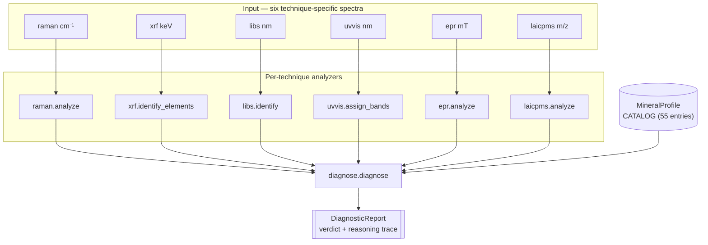

# Check M.S.G.

> A Python toolkit for the **m**inerals, **s**tones, **g**ems and other condensed-matter accretions that show up at the gemological lab bench. Six analytical techniques, a 55-entry mineral catalog, and a unified diagnostic pipeline that produces auditable identification reports — with a 19-step curriculum that teaches the workflow from "diamond vs simulants" through to a capstone integrated diagnosis.


*An unknown green stone, identified as tsavorite via the unified `diagnose()` pipeline using four techniques (Raman + UV-VIS + XRF + LIBS).*

---

## What's inside

`checkmsg` is built around a single `Spectrum` data primitive that every technique speaks. Six analyzer modules turn raw spectra into structured findings. A unified diagnostic pipeline scores every catalog entry against the collected evidence and produces a `DiagnosticReport` with verdict, confidence, full candidate-score table, evidence list, reasoning trace, and follow-up recommendations.



## Quick start

```bash
git clone <this-repo> && cd checkmsg
python -m venv .venv && .venv/bin/pip install -e ".[dev]"
.venv/bin/pytest -q                                                  # 226 tests, ~62 s
.venv/bin/python examples/19_unknown_stone_capstone.py               # full diagnose, prints reasoning trace
```

A minimal Python session:

```python
from checkmsg import minerals
from checkmsg.diagnose import diagnose

profile = minerals.get("ruby")
spectra = [
    minerals.synthesize_raman(profile, noise=0.005),
    minerals.synthesize_uvvis(profile),
    minerals.synthesize_xrf(profile),
]
report = diagnose(spectra, frequency_GHz=9.5)
print(report.render())
```

## Six techniques, six modules

| Technique | Module | What it identifies | Reference data |
|---|---|---|---|
| **Raman** | [`raman.py`](src/checkmsg/raman.py) | Mineral / molecular structure via vibrational modes | RRUFF + catalog peak tables |
| **XRF** | [`xrf.py`](src/checkmsg/xrf.py) | Elements (Z ≥ 11) via characteristic X-ray emission | NIST K/L line tables |
| **LIBS** | [`libs.py`](src/checkmsg/libs.py) | Light elements (Be / Li / B) via plasma emission | NIST Atomic Spectra Database |
| **UV-VIS** | [`uvvis.py`](src/checkmsg/uvvis.py) | Colour origin via electronic transitions | Bundled chromophore table |
| **EPR** | [`epr.py`](src/checkmsg/epr.py) | Unpaired electrons via spin-Hamiltonian simulation | 9 literature-cited centers |
| **LA-ICP-MS** | [`laicpms.py`](src/checkmsg/laicpms.py) | Concentrations + isotope ratios + U-Pb age | NIST SRM 612/610, IUPAC, chondrite REE |
| **Muon imaging (experimental)** | [`muon/`](src/checkmsg/muon/) | 3-D internal density + Z² scattering + element ID for *large composite* subjects | 18 materials (Tsai 1974), muonic K_α tabulation (Engfer et al. 1974) |

Each technique has a dedicated docs page at [`docs/techniques.md`](docs/techniques.md) with schematic, sequence diagram, and worked example.

## Curriculum showcase

Twenty runnable example scripts under `examples/` — single-technique discriminations through a capstone integrated diagnosis, plus an experimental muon-tomography mode for large composite subjects. Pick a tile to dive in.

|  |  |  |
|---|---|---|
| **01** Diamond vs moissanite vs CZ | **04** Sapphire geographic origin | **05** Eight lasers × two temperatures |
|  |  |  |
| **06** EPR unpaired-electron centres | **07** LA-ICP-MS for ambiguous cases | **08** Diamond simulant carousel |
|  |  |  |
| **09** Blue stones disambiguated | **13** Red gems beyond ruby | **19** Capstone integrated diagnosis |
|  |  |  |
| **20** Muon tomography (experimental) |  |  |

Full per-example walkthroughs in [`docs/curriculum.md`](docs/curriculum.md).

## Documentation

- [`docs/architecture.md`](docs/architecture.md) — system overview, class diagram, repository map.
- [`docs/techniques.md`](docs/techniques.md) — per-technique schematics + sequence diagrams + worked outputs.
- [`docs/catalog.md`](docs/catalog.md) — mineral catalog reference + auto-generated confusables graph.
- [`docs/diagnose.md`](docs/diagnose.md) — diagnostic pipeline algorithm, scoring rules, worked example.
- [`docs/curriculum.md`](docs/curriculum.md) — 19 example walkthroughs.

## Reference data sources

The catalog and reference tables are sourced from primary gemological and atomic-physics literature:

- **RRUFF Project** — Raman reference spectra (https://rruff.info), CC-licensed.
- **NIST Atomic Spectra Database** — XRF K/L line energies + LIBS atomic emission lines.
- **IUPAC 2021** — natural-abundance isotope tables.
- **Pearce, Perkins, Westgate, Gorton, Jackson, Neal & Chenery 1997**, *Geostandards Newsletter* 21:115 — NIST SRM 612 / 610 preferred values.
- **McDonough & Sun 1995**, *Chem. Geol.* 120:223 — CI chondrite REE.
- **Stacey & Kramers 1975**, *Earth Planet. Sci. Lett.* 26:207 — terrestrial Pb composition.
- **Steiger & Jäger 1977**, *Earth Planet. Sci. Lett.* 36:359 — U-Pb decay constants.
- **Longerich, Jackson & Günther 1996**, *J. Anal. At. Spectrom.* 11:899 — LA-ICP-MS internal-standard quantitation equation.
- **Loubser & van Wyk 1978**, *Rep. Prog. Phys.* 41:1201 — diamond P1 EPR parameters.
- **Manenkov & Prokhorov 1956**, *Soviet Physics JETP* 1:611 — Cr³⁺ in corundum (the ruby maser system).

Citations for every individual catalog entry live in `src/checkmsg/minerals.py` docstrings.

## Disclaimer

The example scripts and tests use **synthetic spectra** generated for didactic purposes. Real instrument data — with drift, polyatomic interferences, matrix-induced sensitivity changes, and physical inclusions — will degrade `diagnose()` accuracy. This toolkit is **not certified** for commercial gemological identification.

---
