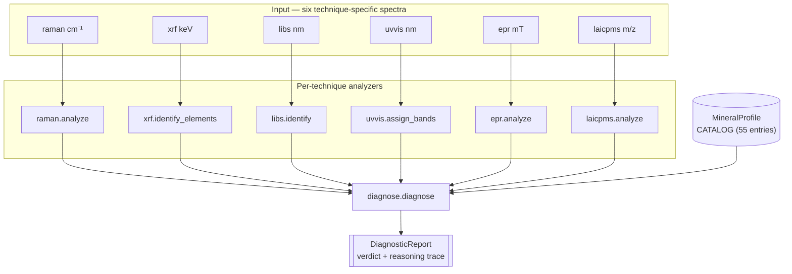
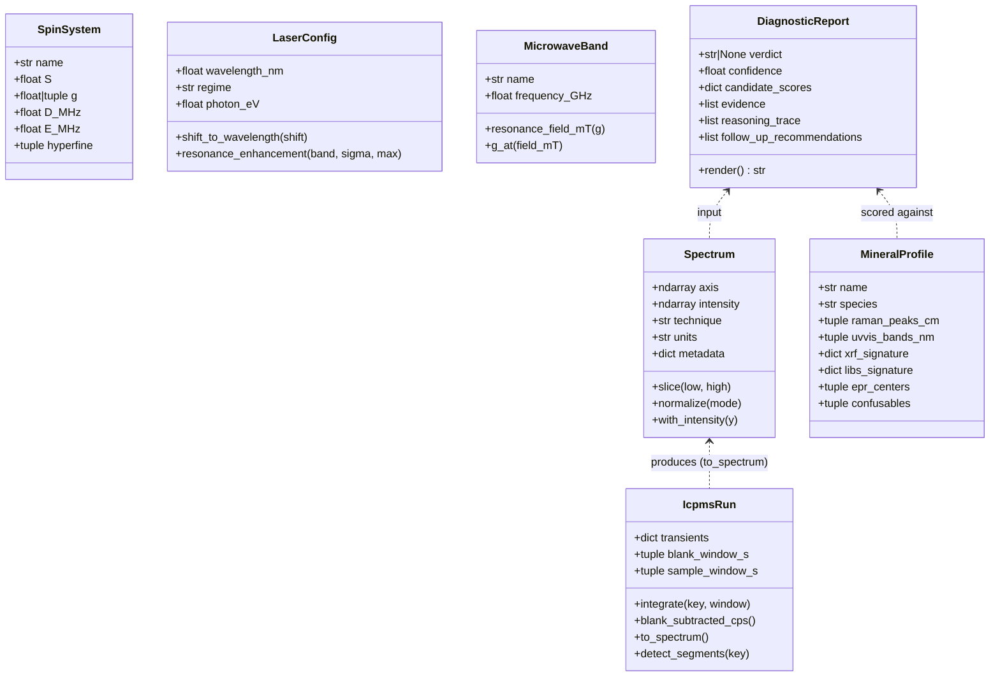

# Architecture

`checkmsg` is a Python toolkit for gemological analysis from spectroscopic data. The architecture is intentionally flat: a single `Spectrum` data primitive, six per-technique analyzer modules, a shared mineral catalog, and a unified diagnostic pipeline that orchestrates them.

## System overview



Every spectrum lands in `Spectrum`, an immutable dataclass that records the axis, intensity, technique tag, units, and free-form metadata. The technique-specific analyzers consume a `Spectrum` and emit either a structured result (e.g. `RamanResult`, `XrfResult`) or a list of detected features (peaks, chromophores, isotope ratios). The diagnostic pipeline turns those analyzer outputs into typed `Evidence` items, scores them against every entry in the mineral catalog, and emits a `DiagnosticReport` with a verdict, confidence, full candidate-score table, reasoning trace, and follow-up recommendations.

## Class diagram



## Repository layout

```
checkmsg/
├── src/checkmsg/
│   ├── spectrum.py            # Spectrum dataclass — every technique speaks this
│   ├── preprocess.py          # ALS / SNIP baseline, Savitzky-Golay smoothing
│   ├── peaks.py               # peak detection, Voigt fitting via lmfit
│   ├── match.py               # cosine + peak-list matching
│   ├── synthetic.py           # spectrum generators (used by examples + tests)
│   ├── raman.py               # Raman analyzer: preprocess → peaks → RRUFF match
│   ├── xrf.py                 # XRF: peak energies → NIST K/L lines → elements
│   ├── libs.py                # LIBS: emission lines → NIST ASD → elements
│   ├── uvvis.py               # UV-VIS: chromophore band assignment
│   ├── epr.py                 # EPR spin-Hamiltonian simulator + analysis
│   ├── laicpms.py             # LA-ICP-MS quant + isotopes + U-Pb + REE
│   ├── identify.py            # combined_report multi-technique fusion
│   ├── diagnose.py            # unified diagnostic pipeline + reasoning trace
│   ├── minerals.py            # MineralProfile catalog (55 entries) + helpers
│   ├── laser.py               # 8-laser catalogue (Raman excitation)
│   ├── microwave.py           # 7-band catalogue (EPR frequencies)
│   ├── temperature.py         # LN2 / room phonon physics
│   ├── cli.py                 # `checkmsg` command-line entry point
│   └── refdata/               # bundled reference data
│       ├── chromophores.py    # UV-VIS chromophore band table
│       ├── epr_centers.py     # 9 EPR centers (DPPH, P1, E1', Cr3+, ...)
│       ├── icpms_data.py      # NIST SRM 612/610, IUPAC isotopes, chondrite REE
│       ├── nist_xray.py       # K/L line table (X-ray)
│       ├── nist_asd.py        # atomic emission lines (LIBS)
│       └── rruff.py           # RRUFF Raman fetcher with on-disk cache
├── examples/                  # 19 curriculum scripts (01..19)
├── docs/                      # this directory
├── tools/                     # build_schematics.py, build_confusables_graph.py
└── tests/                     # 200+ tests covering all modules
```

## Where to look

| Question | File |
|---|---|
| "What's a Spectrum?" | `src/checkmsg/spectrum.py` |
| "How does technique X work?" | `src/checkmsg/<technique>.py` |
| "Why is this mineral confused with that one?" | `src/checkmsg/minerals.py` |
| "How does the diagnose pipeline score candidates?" | `src/checkmsg/diagnose.py` |
| "Where are reference spectra cached?" | `~/.cache/checkmsg/rruff/` (overridable via `CHECKMSG_CACHE`) |
| "How do I make a synthetic spectrum?" | `src/checkmsg/synthetic.py` |
| "Where are the worked examples?" | `examples/` (curriculum 01..19); `docs/curriculum.md` for narrated walkthroughs |

## Data-flow narrative

A typical analysis runs like this:

1. Load or measure a `Spectrum` (axis + intensity + technique tag).
2. Run `<technique>.analyze` (or call `diagnose([spec1, spec2, ...])`).
3. The analyzer pre-processes (baseline, smoothing), detects features, and matches them against bundled reference data.
4. The analyzer's output is wrapped in `Evidence` items by `diagnose`.
5. `diagnose` walks every `MineralProfile` in `CATALOG` and accumulates evidence-derived scores.
6. The top-ranked profile becomes the verdict; the runner-ups appear as confusables ruled out.
7. `DiagnosticReport.render()` produces a multi-paragraph human-readable explanation.

For a worked end-to-end walk-through, see [`curriculum.md`](curriculum.md), specifically example 19 (the capstone).
