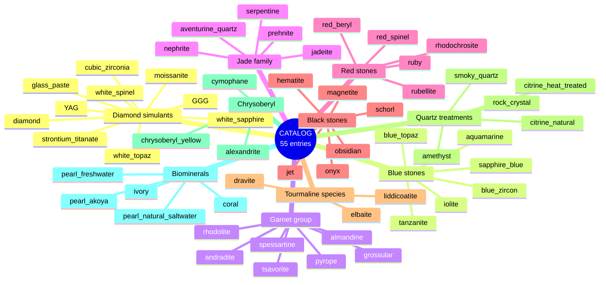
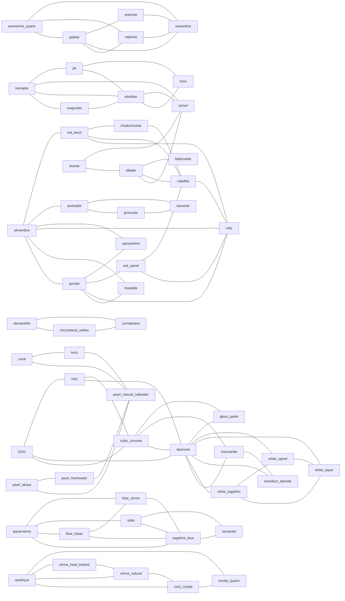

# Mineral catalog reference

`src/checkmsg/minerals.py` ships a catalog of 55 gemstones across 10 thematic groups. Every entry is a `MineralProfile` carrying chemical, physical, and spectroscopic fingerprints — enough to drive both the synthesis helpers and the diagnostic pipeline.

## Catalog structure



(Some minerals appear in more than one group's narrative — e.g. pyrope is both a garnet end-member and a red gem — but each has exactly one canonical entry.)

## MineralProfile schema

Every catalog entry holds:

| Field | Purpose |
|---|---|
| `name`, `species`, `aliases` | Canonical name + taxonomic species + commercial / historical names |
| `chemical_formula` | Stoichiometric formula (with dopants) |
| `crystal_system`, `mohs_hardness`, `density_g_cc`, `refractive_index` | Physical context |
| `common_colors` | Tuples for `by_color` filter |
| `raman_peaks_cm` | `((position, rel_intensity), ...)` for `synthesize_raman` and Raman matching |
| `uvvis_bands_nm` | Centers of absorption bands |
| `chromophores` | Keys into `refdata/chromophores.py` |
| `xrf_signature` / `libs_signature` | Element → `"major"`/`"minor"`/`"trace"`/`"absent"` |
| `epr_centers` | Keys into `refdata/epr_centers.py` |
| `icpms_diagnostic_isotopes` | Isotope keys diagnostic for the mineral |
| `confusables` | Names of catalog entries commonly mistaken for this one |
| `diagnostic_features` | Human-readable identifying features |
| `references` | Literature citations |

## Confusables graph (auto-generated)

Every mineral lists `confusables` — the others most easily mistaken for it. The undirected graph is built from `tools/build_confusables_graph.py` (run before each release to keep this diagram in sync with the catalog):



The graph clusters by gem family — the catalog's confusables encode the *natural* groupings a working gemmologist would expect.

## Lookup helpers

```python
from checkmsg import minerals
minerals.get("imperial jade")        # alias-aware → returns jadeite profile
minerals.by_species("garnet")        # all 7 garnet end-members
minerals.by_color("blue")            # 6 blue gems (and any others with blue in colors)
minerals.by_confusable("ruby")       # all minerals listing ruby as a confusable
minerals.resolve_confusables("ruby") # the ruby profile's confusables resolved to entries
```

## Profile-driven synthesis

Each profile can synthesise spectra for any of the six techniques via the catalog helpers:

```python
from checkmsg.minerals import get, synthesize_raman, synthesize_uvvis, synthesize_xrf, synthesize_libs, synthesize_epr
profile = get("ruby")
raman_spec = synthesize_raman(profile, noise=0.005)
uv_spec    = synthesize_uvvis(profile)
xrf_spec   = synthesize_xrf(profile)
libs_spec  = synthesize_libs(profile)
epr_spec   = synthesize_epr(profile, frequency_GHz=9.5)
```

This is the path used by `diagnose.diagnose_profile(profile)` and by every catalog-driven curriculum example in `examples/08..19`.

For technique-by-technique deep dives see [`techniques.md`](techniques.md). For the diagnostic pipeline that consumes these synthesised spectra, see [`diagnose.md`](diagnose.md).
