# Curriculum — 19 worked examples

Every example script under `examples/` is a self-contained gemmological scenario. They build from "diamond vs simulants" through "garnet species" to a full multi-technique capstone diagnosis. Each section below shows the expected plot, the diagnostic narrative, the key code excerpt, and a follow-on question for the learner.

The curriculum arc:

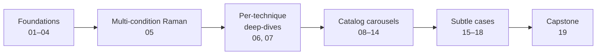
```mermaid
flowchart LR
    A["Foundations<br/>01–04"] --> B["Multi-condition Raman<br/>05"]
    B --> C["Per-technique<br/>deep-dives<br/>06, 07"]
    C --> D["Catalog carousels<br/>08–14"]
    D --> E["Subtle cases<br/>15–18"]
    E --> F["Capstone<br/>19"]
```

Run any example offline:

```bash
python examples/NN_<theme>.py            # full run, saves plot to examples/output/
python examples/NN_<theme>.py --smoke    # CI-style: no plot, asserts only
```

---

## 01 — Diamond vs moissanite vs cubic zirconia

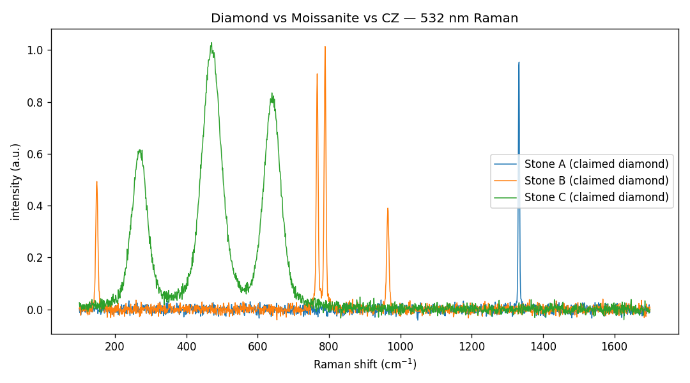

**Scenario.** A buyer presents three colourless brilliants claimed to be diamond. One is genuine, one is moissanite (6H-SiC), and one is cubic zirconia. A confocal Raman microscope at 532 nm separates them in seconds.

| Specimen | Diagnostic feature |
|---|---|
| diamond | razor-sharp F2g peak at 1332.5 cm⁻¹, FWHM ≈ 1.5 cm⁻¹ |
| moissanite | folded LO/TO doublet at 767 + 789 cm⁻¹, plus 149 + 965 cm⁻¹ |
| cubic zirconia | only broad bands at 269/471/641 cm⁻¹ — no narrow modes |

**Key technique** — Raman fingerprint matching against the (synthetic) RRUFF cache.

```python
result = raman.analyze(spec, candidates=["diamond", "moissanite", "corundum"])
result.best.mineral, result.best.cosine
# ('diamond', 0.96)
```

**Follow-on**: How would you discriminate a *coloured* CZ (e.g. red-dyed) from a real ruby with the same approach? (Hint: the broad-band Raman is invariant to colour, but the chromophore Cr³⁺ band makes ruby's UV-VIS distinct.)

---

## 02 — Natural vs synthetic ruby

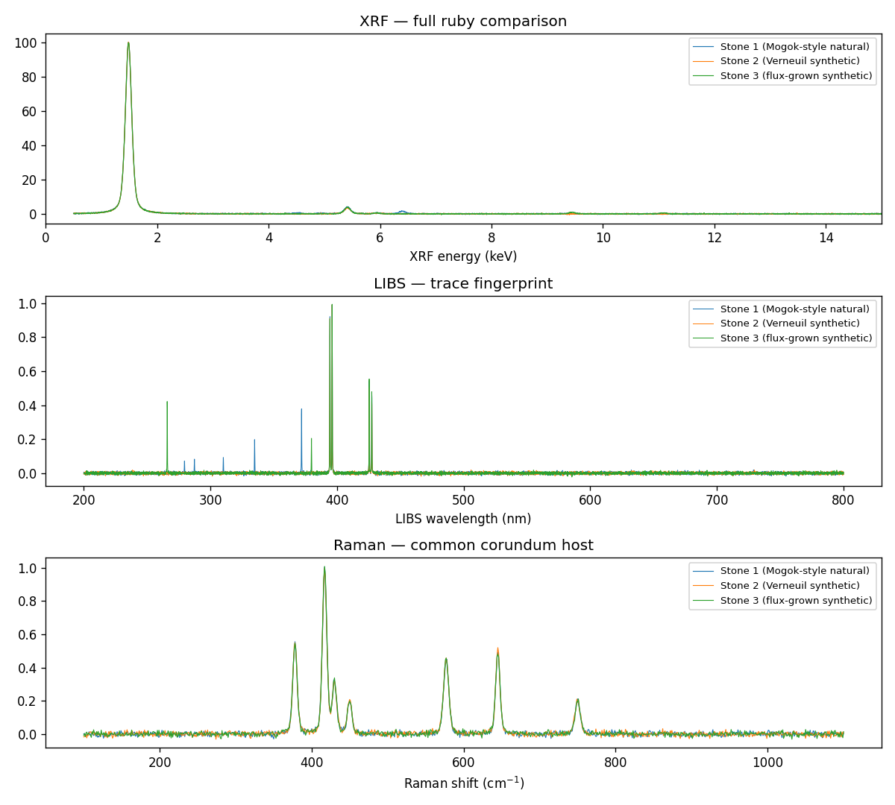

**Scenario.** Three rubies share the corundum Raman fingerprint exactly. Origin and growth method must come from *trace elements*: natural Mogok ruby has Fe/Ti/V/Ga; flame-fusion (Verneuil) shows almost only Cr; flux-grown shows Pt/Mo flux residues.

**Key technique** — XRF + LIBS trace-element fingerprinting. Same Raman → same host material; chemistry → growth method.

```python
xresult = xrf.identify_elements(xspec, tolerance_keV=0.05, min_snr=8.0)
lresult = libs.identify(lspec, tolerance_nm=0.4)
verdict = classify(lresult, xresult)
```

The classification rule: Pt and/or Mo present → flux-grown; ultra-clean (only Al + Cr) → Verneuil; Fe + Ti + V/Ga present → natural.

**Follow-on**: What if a flux-grown synthetic was *re-faceted* and the surface scrubbed clean of flux? (Hint: LA-ICP-MS depth profiling — example 18.)

---

## 03 — Emerald vs green glass

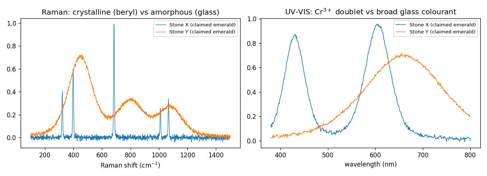

**Scenario.** A parcel of green stones — some real Cr³⁺-coloured beryl emerald, some glass paste. Both can look identical to the naked eye. Two complementary signatures resolve them:

- **Raman**: emerald shows sharp beryl ring modes (685, 1067 cm⁻¹). Glass shows a broad amorphous Si-O envelope around 460 cm⁻¹ with no sharp peaks.
- **UV-VIS**: emerald shows the Cr³⁺ d-d doublet (~430 + 605 nm in beryl host). Glass shows whatever colourant was added — usually no chromophore the catalog recognises.

**Key technique** — crystalline-vs-amorphous Raman test, plus UV-VIS chromophore confirmation.

```python
amorphous = raman.is_amorphous(rspec)
chromophores = uvvis.assign_bands(uspec).chromophores()
has_cr3 = any("Cr3+" in c.name for c in chromophores)
```

**Follow-on**: How would you flag a *Cr-doped glass* (chrome aventurine glass with deliberate Cr addition)? (Hint: the Raman amorphous halo persists, even though the UV-VIS Cr³⁺ chromophore is present.)

---

## 04 — Sapphire geographic origin

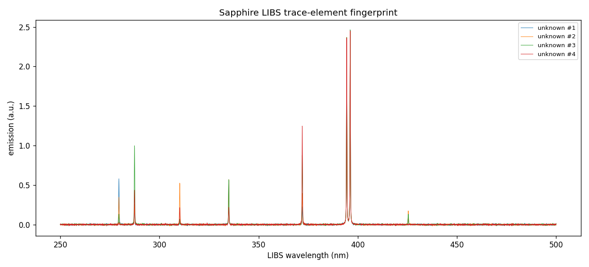

**Scenario.** All blue sapphires share the corundum Raman fingerprint. Origin determines value — Kashmir > Burma >> Madagascar/Montana. LIBS trace-element ratios produce locality-specific patterns.

| Origin | Trace pattern (relative) |
|---|---|
| Kashmir | low Fe, moderate Ti, low Ga, high Mg |
| Burma | moderate Fe, high Ti, low Ga, high V |
| Madagascar | high Fe, moderate Ti, very high Ga |
| Montana | very high Fe, low Ti, moderate Ga |

**Key technique** — Mahalanobis-distance classifier on a 6-element trace feature vector against bundled centroids in `examples/data/sapphire_origins.json`.

```python
distances = {origin: np.linalg.norm(features - centroid) for origin, centroid in centroids.items()}
predicted = min(distances, key=distances.get)
```

**Follow-on**: Real labs use additional isotopic + inclusion data. Why are trace-element ratios alone not enough for legal certification? (Hint: lab-grown stones can be doped to mimic any signature.)

---

## 05 — Multi-laser, multi-temperature Raman

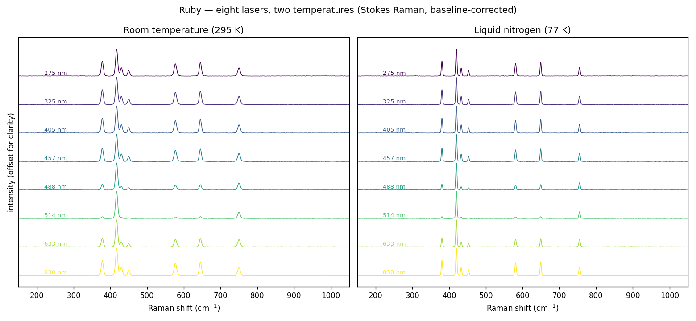

**Scenario.** The same ruby specimen, measured on a Raman microscope equipped with eight laser lines (275 / 325 / 405 / 457 / 488 / 514 / 633 / 830 nm) and a liquid-nitrogen cryostage. Sixteen spectra in total. Five effects emerge that none of them shows in isolation:

1. **Fingerprint invariance** — corundum peak positions in cm⁻¹ are identical regardless of laser. Spread across all 8 lasers ≈ 0.08 cm⁻¹.
2. **1/λ⁴ scaling** — UV gives ~80× larger raw signal than NIR.
3. **Cr³⁺ resonance enhancement** — 514 nm (close to the 4A2 → 4T2 absorption at ~555 nm) gives ~8.5× boost on the Cr-coupled modes; 830 nm shows none.
4. **Fluorescence interference** — 488 / 514 nm pump strong red Cr-PL emission; 830 nm escapes it. UV escapes by being above the visible PL window.
5. **Temperature signatures** — at 77 K, peaks narrow (FWHM ~3.6 vs ~7.0 cm⁻¹ at 295 K) and blue-shift by ~2.6 cm⁻¹. Stokes / anti-Stokes intensity ratio gives an independent thermometer.

**Key technique** — `synthetic.generate(laser_nm=..., temperature_K=..., include_antistokes=True)` plus `raman.infer_temperature` for thermometric inversion.

```python
spec = generate(RUBY_PEAKS, axis, technique="raman", units="cm-1",
               laser_nm=514, temperature_K=77, include_antistokes=True)
T_recovered = raman.infer_temperature(spec, mode_cm=417.0)
```

**Follow-on**: Which of the eight lasers would you choose as default for an unknown gemstone, and why? (Hint: 830 nm gives the cleanest baseline; 514 nm gives the highest signal-to-noise on Cr-bearing samples; UV lasers risk damaging organic-bearing specimens.)

---

## 06 — EPR identification of unpaired electrons

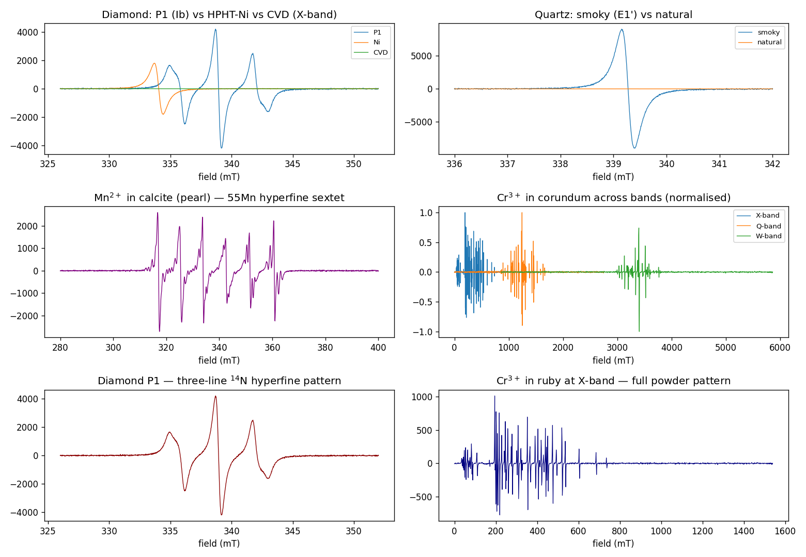

**Scenario.** Five EPR mini-scenarios on synthetic CW first-derivative spectra produced by a real spin-Hamiltonian simulator:

1. **Diamond P1 vs HPHT-Ni vs CVD** — P1 nitrogen triplet, Ni single line, near-empty CVD baseline.
2. **Smoky vs natural quartz** — E1' oxygen-vacancy centre marks irradiation.
3. **Mn²⁺ pearl/calcite fingerprint** — six-line ⁵⁵Mn hyperfine sextet (recovered A_iso within 20 % of the literature 245 MHz).
4. **Cr³⁺ ruby across X / Q / W bands** — fine-structure splitting governed by D ≈ 5.7 GHz, resolved differently at each frequency.
5. **DPPH-referenced spin counting** — double-integrate the P1 spectrum, scale against synthetic DPPH.

**Key technique** — `epr.simulate_field_sweep` (real diagonalisation of the spin Hamiltonian) + cosine match against bundled `EPR_CENTERS`.

```python
result = epr.analyze(spec, frequency_GHz=9.5, candidates=EPR_CENTERS)
result.best.name           # 'diamond_P1'
result.g_factors           # [2.0024, 2.0026, 2.0028]
```

**Follow-on**: Why does Cr³⁺ in corundum give a complex powder pattern at X-band but simpler features at W-band? (Hint: the high-field limit hν >> D simplifies the eigenstates.)

---

## 07 — LA-ICP-MS for ambiguous and complex cases

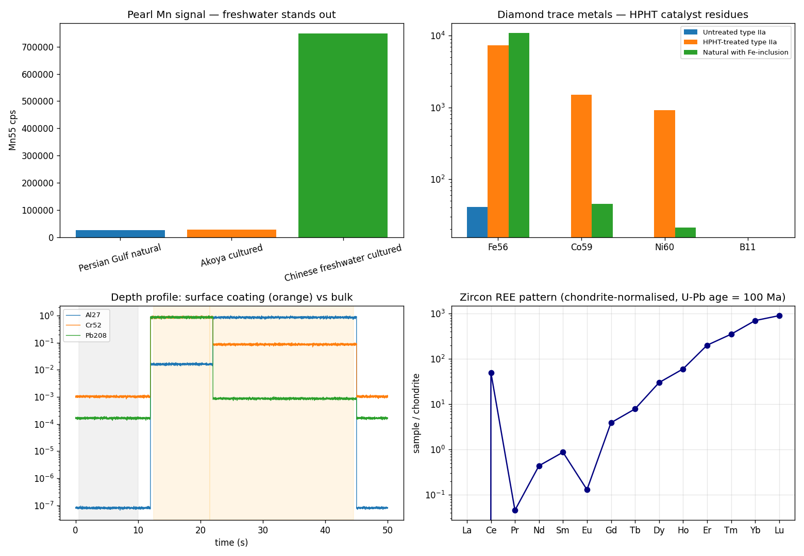

**Scenario.** Four scenarios where Raman / XRF / UV-VIS / EPR alone leave room for ambiguity, solved by a single LA-ICP-MS measurement:

1. **Pearl natural vs Akoya cultured vs freshwater** — Mn quant + ²⁰⁶Pb/²⁰⁴Pb isotope ratio (bead Pb signature in akoya).
2. **HPHT-treated type IIa diamond** — Fe + Co + Ni catalyst residues at ppm levels.
3. **Surface-coating depth profile** — change-point segmentation reveals coating + bulk plateaus.
4. **Cretaceous zircon U-Pb age + REE pattern** — recovers 100 ± 5 Ma age plus the strong negative Eu anomaly that confirms igneous zircon.

**Key technique** — full LA-ICP-MS pipeline: Longerich quantitation + Pb isotope ratios + U-Pb concordant ages + REE chondrite normalisation.

```python
result = laicpms.analyze(sample_run, calibration=cal_run,
                         internal_standard=("Zr", 480000.0))
result.u_pb_age_Ma                   # 100.0
result.isotope_ratios["207/206"]     # 0.045
laicpms.eu_anomaly(result.ree_pattern)  # 0.07 (strong negative)
```

**Follow-on**: A pearl shows high Mn (>500 ppm) but the Pb ratio looks marine. Bead-nucleus contamination from a coastal-mussel shell is possible. How would you distinguish? (Hint: depth profile — bead Pb is concentrated at the centre of the pearl, not the surface.)

---

## 08 — Diamond simulant carousel

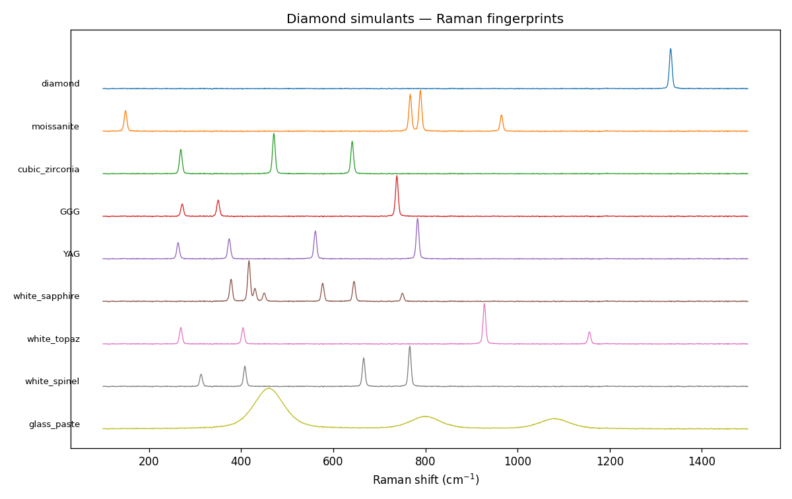

**Scenario.** A jeweller offers eight colourless brilliants claimed to be diamond. Only one is. The unified `diagnose()` pipeline returns the canonical mineral name with reasoning trace for every specimen. Specimens: diamond, moissanite, cubic zirconia, GGG, YAG, white sapphire, white topaz, white spinel, glass paste.

**Key technique** — pipeline = Raman fingerprint + UV-VIS / XRF / LIBS evidence; verdicts come from the additive scoring rules in `diagnose.diagnose`.

```python
from _common import run_carousel
specimens = ["diamond", "moissanite", "cubic_zirconia", "GGG", "YAG",
             "white_sapphire", "white_topaz", "white_spinel", "glass_paste"]
run_carousel("diamond simulant carousel", specimens)
# accuracy: 9/9
```

**Follow-on**: What's the smallest set of diagnostic features that uniquely identifies all nine? (Hint: dominant Raman peak position + width is enough for most; density distinguishes the rest.)

---

## 09 — Blue-stone disambiguation

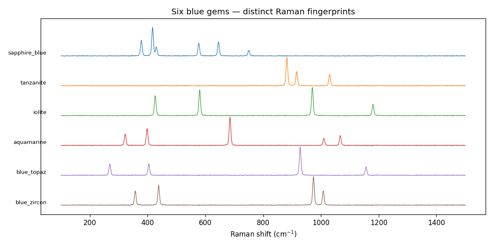

**Scenario.** Six chemically unrelated gems share a colour: sapphire (corundum), tanzanite (zoisite), iolite (cordierite), aquamarine (beryl), blue topaz, blue zircon. The combined Raman + UV-VIS pipeline resolves all six.

**Key technique** — Raman fingerprint identifies the host species; UV-VIS chromophores identify the electronic transition responsible for the blue colour (each gem absorbs a different wavelength range, and the transmitted complementary colour appears blue).

| Gem | Chromophore (cause of colour) |
|---|---|
| sapphire | Fe²⁺/Ti⁴⁺ IVCT (~580 nm) |
| tanzanite | V³⁺ d-d (~595 + 730 nm) |
| iolite | Fe²⁺ d-d (~426 + 596 nm, with strong pleochroism) |
| aquamarine | Fe²⁺ in channel sites (~372 + 829 nm) |
| blue topaz | irradiation-induced colour centre (~620 nm) |
| blue zircon | heat-treatment colour centre |

**Follow-on**: Without UV-VIS available, could you still discriminate aquamarine from blue topaz? (Hint: yes — Be detection in LIBS is unique to beryl.)

---

## 10 — Garnet species suite

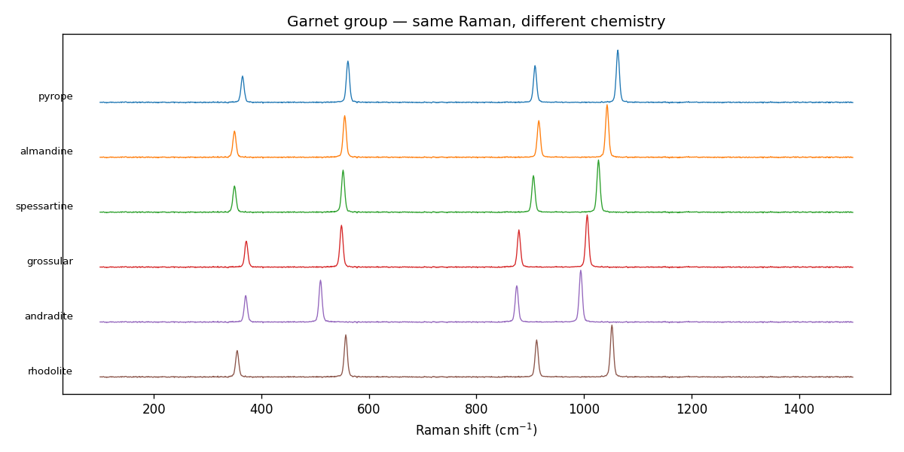

**Scenario.** Five garnet end-members share the cubic crystal structure and the SiO₄ tetrahedron, so their Raman patterns are closely similar. The chemical end-members differ in the dominant cation:

| End-member | Formula | Colour | Diagnostic chemistry |
|---|---|---|---|
| pyrope | Mg₃Al₂(SiO₄)₃ | red | Mg-rich |
| almandine | Fe₃Al₂(SiO₄)₃ | dark red | Fe-rich |
| spessartine | Mn₃Al₂(SiO₄)₃ | orange | Mn-rich |
| grossular | Ca₃Al₂(SiO₄)₃ | green/orange | Ca-rich |
| andradite | Ca₃Fe₂(SiO₄)₃ | green/black | Ca + Fe³⁺ |

**Key technique** — chemistry-led ID. Same Raman → host species. Different majors → end-member.

**Follow-on**: How would the diagnose pipeline handle an *intermediate* composition like a 50/50 pyrope-almandine mix? (Hint: Mg + Fe both detected → rhodolite is the right verdict.)

---

## 11 — Jade family confusion

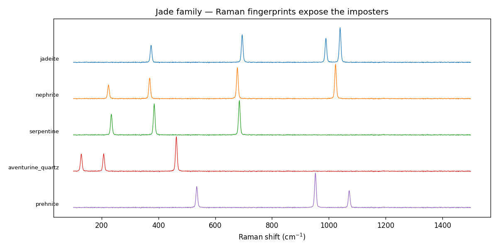

**Scenario.** Four very different minerals all sold as "jade":

- **Jadeite** — NaAlSi₂O₆, pyroxene, "imperial jade".
- **Nephrite** — Ca₂(Mg,Fe)₅Si₈O₂₂(OH)₂, amphibole, traditional Asian jade.
- **Serpentine** — (Mg,Fe)₃Si₂O₅(OH)₄, much softer ("new jade").
- **Aventurine quartz** — SiO₂ + fuchsite ("Indian jade", actually quartzite).
- **Prehnite** — recently marketed as "olive jade".

Hardness alone (jadeite 6.5–7 vs serpentine 2.5–5.5) is enough to separate some in jewellery practice. Raman gives a clean, non-destructive ID.

**Follow-on**: Which of these "jades" would the buyer most likely accept based on cut and polish alone? (Hint: aventurine quartz has the highest hardness of the imitations and takes a similar polish.)

---

## 12 — Tourmaline species

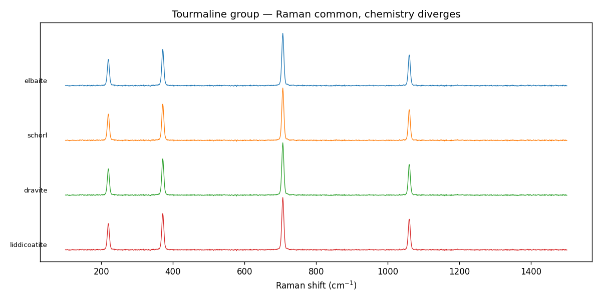

**Scenario.** The tourmaline group shares a (BO₃)₃Si₆O₁₈ framework but differs in the X-site and Y-site occupants. Four species:

- **Elbaite** — Li-rich, multicolor including watermelon.
- **Schorl** — Fe-rich, black.
- **Dravite** — Mg-rich, brown.
- **Liddicoatite** — Ca-Li, famous for triangular cross-section colour zoning.

**Key technique** — Raman patterns are nearly identical across species; LIBS chemistry (Li / B / Mg / Fe / Ca levels) is the discriminator.

**Follow-on**: A green tourmaline turns out to be elbaite by chemistry. Could it be coloured by Cr³⁺ chromium tourmaline (a rare collector's variety)? (Hint: yes — the catalog distinguishes elbaite by *crystal chemistry*, not colour. UV-VIS Cr³⁺ chromophore confirms.)

---

## 13 — Red gems carousel

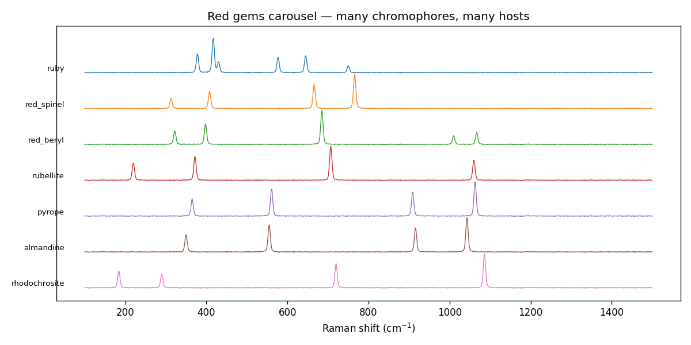

**Scenario.** Red colour comes from many distinct chromophores. Without lab analysis a buyer could mistake any of these for ruby:

| Red gem | Host mineral | Chromophore |
|---|---|---|
| ruby | corundum | Cr³⁺ |
| red spinel | spinel | Cr³⁺ |
| red beryl | beryl | Mn³⁺ |
| rubellite | elbaite tourmaline | Mn²⁺ |
| pyrope | garnet | Fe²⁺ |
| almandine | garnet | Fe²⁺ |
| rhodochrosite | manganese carbonate | Mn²⁺ |

The pipeline picks the host mineral via Raman, then confirms the chromophore species via UV-VIS.

**Follow-on**: The historical "Black Prince's Ruby" in the British Crown Jewels turned out to be a red spinel. What single Raman peak would have settled the matter? (Hint: spinel's 766 cm⁻¹ A1g mode is unmistakable.)

---

## 14 — Black opaque stones

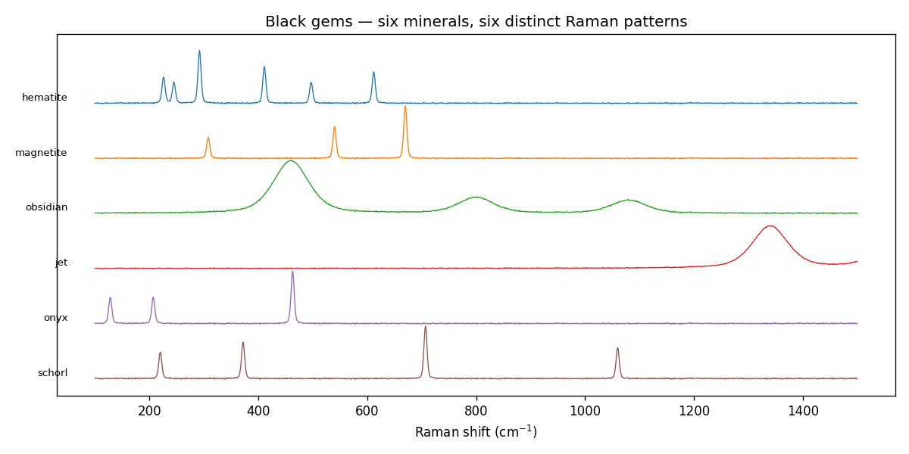

**Scenario.** Six black gems span four chemical systems:

| Black gem | Chemistry | Density |
|---|---|---|
| hematite | α-Fe₂O₃ | 5.3 g/cc |
| magnetite | Fe₃O₄ | 5.2 g/cc, magnetic |
| obsidian | amorphous SiO₂ | 2.4 g/cc |
| jet | carbonised lignite | 1.3 g/cc |
| onyx | banded quartz chalcedony | 2.6 g/cc |
| schorl | Fe-tourmaline | 3.2 g/cc |

Density spans 1.3 → 5.3 — a four-fold range. Raman crisply separates organic (jet, 1340 + 1580 cm⁻¹ carbon D + G bands), amorphous (obsidian, broad 460 cm⁻¹), crystalline silicate (onyx, schorl), and oxide (hematite, magnetite).

**Follow-on**: Without a Raman spectrometer, what single bench-top test would distinguish jet from onyx? (Hint: density. Jet floats in water-bromoform mixture; onyx sinks.)

---

## 15 — Quartz treatment history

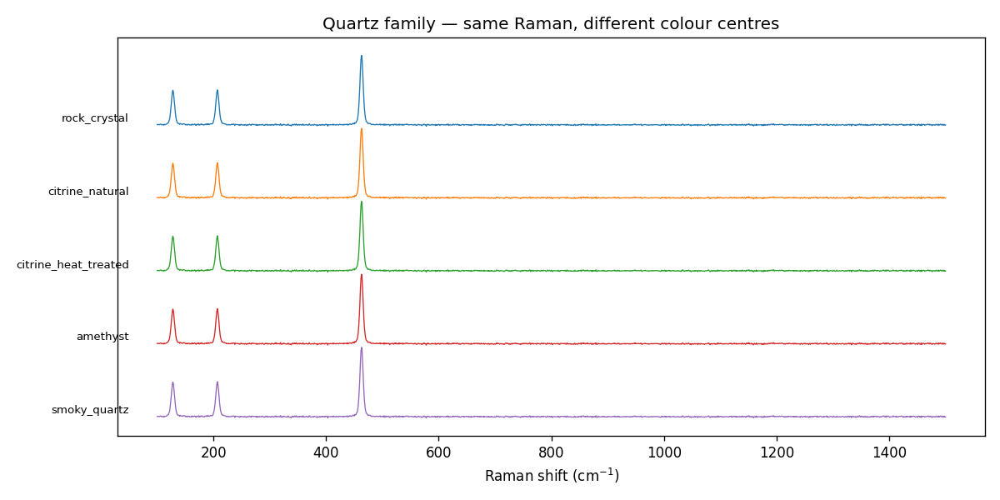

**Scenario.** Five quartz varieties all share Raman: 128 + 207 + 463 cm⁻¹. They differ in their colour-centre population, which encodes the geological / treatment history:

| Variety | Colour centre |
|---|---|
| rock crystal | none — clean SiO₂ |
| natural citrine | Fe³⁺ on tetrahedral site (geological) |
| heat-treated citrine | from amethyst — retains residual E1' EPR centre |
| amethyst | Fe⁴⁺ on tetrahedral site, post-irradiation |
| smoky quartz | Al-hole + E1' centres (irradiation) |

This is a deliberately hard case for the diagnostic pipeline — Raman alone cannot separate them, and even with EPR + UV-VIS the discrimination is subtle. The educational point is that quartz colour-centre history is genuinely a hard case where a single technique rarely succeeds. Real labs use FTIR + photoluminescence as well.

**Follow-on**: How can you tell heat-treated citrine (formerly amethyst) from natural citrine? (Hint: heat treatment doesn't fully erase the original irradiation history — residual E1' EPR centres persist.)

---

## 16 — Chrysoberyl trio

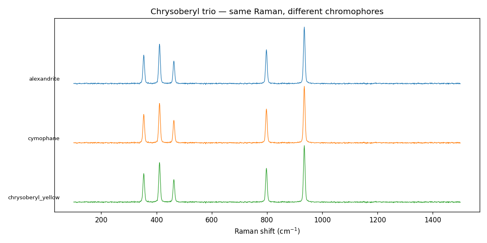

**Scenario.** Three chrysoberyl varieties exhibit different optical phenomena despite sharing the host mineral:

- **Alexandrite** — Cr³⁺-coloured chrysoberyl. The "alexandrite effect": green in daylight (5500 K), red under tungsten light (2700 K). The Cr³⁺ absorption profile has minima near 480 nm (blue-green) and 700 nm (red); under daylight the blue-green transmission window dominates because the illuminant is rich in short wavelengths, while under tungsten light the red window dominates because the illuminant peaks in the red — the same gem appears different colours under different spectral power distributions.
- **Cymophane** — chrysoberyl with rutile silk inclusions creating cat's-eye chatoyancy. Ti from rutile is the diagnostic XRF marker.
- **Chrysoberyl yellow** — pure Fe-coloured chrysoberyl, no Cr.

All share Raman 354 / 411 / 463 / 798 / 935 cm⁻¹.

**Follow-on**: A "cat's-eye alexandrite" — chrysoberyl with both Cr³⁺ and rutile silk. How does the diagnose pipeline rank it? (Hint: it favours both alexandrite *and* cymophane; the reasoning trace shows both pieces of evidence.)

---

## 17 — Biomineral disambiguation

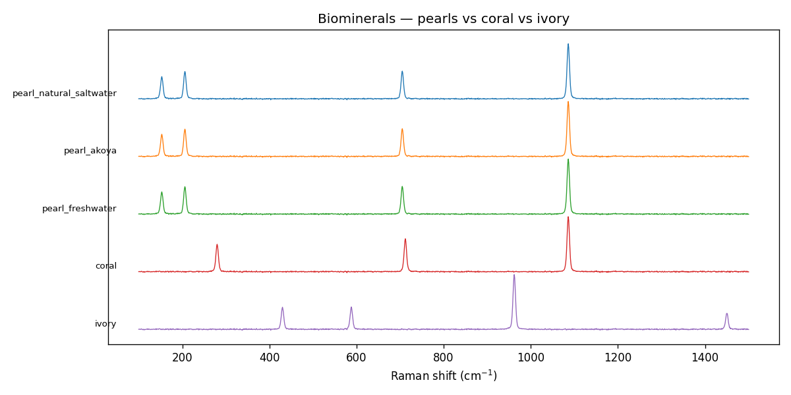

**Scenario.** Five biogenic gem materials with overlapping appearance:

| Biomaterial | Mineral | Raman ν₁ |
|---|---|---|
| natural saltwater pearl | aragonite | 1086 cm⁻¹ |
| akoya cultured pearl | aragonite + freshwater bead | 1086 cm⁻¹ |
| freshwater cultured pearl | aragonite | 1086 cm⁻¹ |
| coral | aragonite/calcite | 1086 cm⁻¹ |
| ivory | hydroxyapatite | 962 cm⁻¹ |

Raman is the first cut: ivory's 962 cm⁻¹ phosphate ν₁ mode is unmistakable against the aragonite carbonate 1086 cm⁻¹. Pearls and coral are then discriminated via EPR Mn²⁺ + LA-ICP-MS Pb isotopes (see example 07 for the full pearl scenario).

**Follow-on**: How would you flag fossil ivory (mammoth) vs modern elephant ivory? (Hint: LA-ICP-MS for trace REE; mammoth ivory reflects the geological burial environment.)

---

## 18 — Treatment-detection workflow

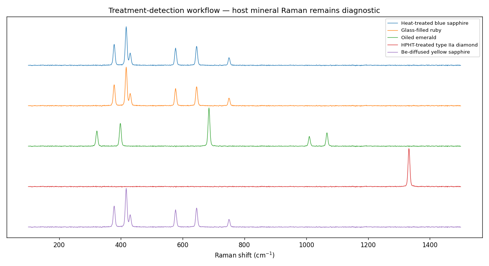

**Scenario.** Five treated stones present cosmetically as their natural counterparts but carry diagnostic signatures of enhancement:

| Treatment | Detection |
|---|---|
| heat-treated sapphire | silk dissolution; Fe / Ti redistribution; EPR Fe³⁺ linewidth narrows |
| glass-filled ruby | Pb in XRF + amorphous Raman halo over the cavity; LA-ICP-MS Pb spikes during depth profile |
| oiled emerald | CH-stretch Raman bands ~2900–3000 cm⁻¹ |
| HPHT-treated diamond | catalyst residues (Fe + Co + Ni at ppm levels) via LA-ICP-MS |
| Be-diffused sapphire | LA-ICP-MS depth profile of surface Be enrichment |

The pipeline handles the *host* identification reliably. Treatment-specific diagnostics live in the reasoning trace's follow-up recommendations.

**Follow-on**: Can the pipeline catch a *combined* treatment — say, heat-treated and Be-diffused sapphire? (Hint: each treatment's signature is independent. Heat treatment narrows EPR linewidth; Be diffusion shows up only in depth-profile LIBS / LA-ICP-MS.)

---

## 19 — Capstone: diagnose an unknown stone

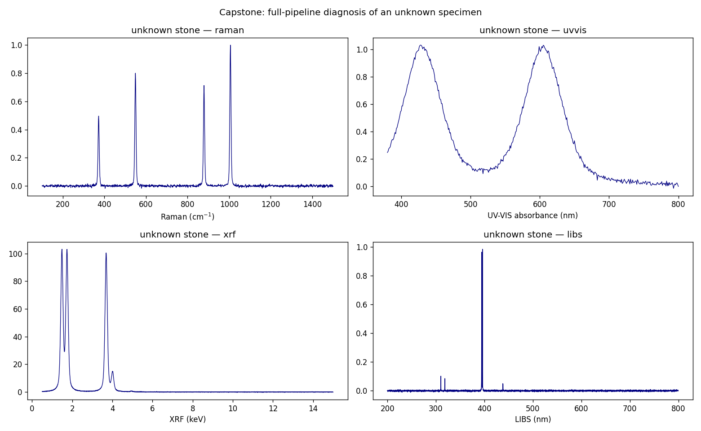

**Scenario.** A jeweller hands the lab a translucent green cabochon. It could be tsavorite (V-grossular), demantoid, peridot, jadeite, or emerald. The lab measures four techniques (Raman + UV-VIS + XRF + LIBS) and feeds everything to `diagnose()`. The reasoning trace makes every decision auditable:

```python
spectra = [
    minerals.synthesize_raman(profile),
    minerals.synthesize_uvvis(profile),
    minerals.synthesize_xrf(profile),
    minerals.synthesize_libs(profile),
]
report = diagnose(spectra, frequency_GHz=9.5)
print(report.render())
```

The capstone diagnosis identifies tsavorite via:
1. **Raman** — six matched peaks favour the garnet group (tsavorite, grossular, andradite).
2. **UV-VIS** — V³⁺ d-d chromophore favours tsavorite specifically (grossular and andradite don't list V³⁺).
3. **XRF** — Ca + Al + Si majors confirm Ca-Al silicate.
4. **LIBS** — V detected at trace level → V is non-matrix → favours tsavorite (which lists V) over grossular (which doesn't).

The verdict is **tsavorite** with confidence ~1.0. Read the full reasoning trace by running `python examples/19_unknown_stone_capstone.py` and looking at the `Reasoning trace:` section it prints.

**Follow-on**: What single piece of evidence would *change* the verdict from tsavorite to demantoid (Cr³⁺-grossular)? (Hint: LIBS Cr instead of V trace.)

---

## 20 — Muon tomography (experimental)

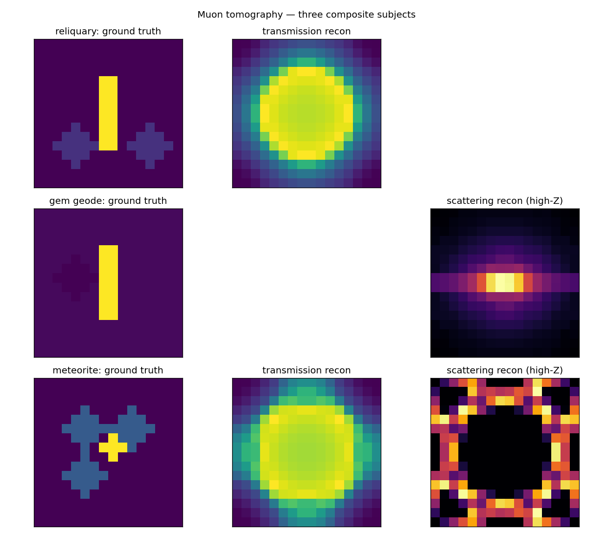

**Scenario.** Three large composite subjects, each beyond the reach of the cm-scale techniques in `01..19`:

1. **Sealed reliquary** — a 10 cm cube of polymer filler housing a Pt-wire armature, ruby clusters, and a hollow void. The contents must be characterised without breaking the seal.
2. **Composite gem geode** — a 5 cm corundum specimen with a Pt-wire inclusion and a diamond cluster. Only Z-contrast distinguishes the inclusions from the host.
3. **Meteorite cross-section** — a 10 cm pallasite analogue with Fe-Ni metal phases in olivine matrix, plus a small Au inclusion (1-voxel scale).

**Key technique.** Muon imaging — three modes orchestrated by `checkmsg.muon.analyze`:

- **Transmission tomography** for density mapping (reliquary, meteorite).
- **Multiple Coulomb scattering tomography** for Z²-weighted hot-spot localisation (geode).
- **Muonic-K_α spectroscopy** of the stopping-muon flux for non-destructive elemental ID (the Au inclusion in scenario 3).

```python
from checkmsg.muon import VoxelGrid, MuonSource, analyze
g = VoxelGrid.filled((16, 16, 16), "corundum", spacing_mm=(2.0,) * 3)
g.set_box((6, 6, 6), (10, 10, 10), "platinum")
src = MuonSource(mean_momentum_MeV=200, flux_per_s=1e9, polarity="negative")
img = analyze(g, src, scattering=True, n_projections=18, pixels_per_side=16, muons_per_ray=8)
# img.scattering_density_map highlights the Pt inclusion
```

**Expected output**: each scenario prints its diagnostic (correlation vs ground truth, hot-spot ratio, detected K_α elements). The full-mode run produces a 3×3 figure: rows are the three subjects, columns are (ground truth slice, transmission reconstruction, scattering reconstruction).

**Follow-on**: A real cosmic-ray muography measurement of an Egyptian pyramid takes months because the cosmic-ray muon flux is ~1 µ cm⁻² min⁻¹. Our simulator assumes 10⁹ µ/s. What hardware development would close the gap? (Hint: spallation-target sources at MW-class proton accelerators, surface-muon production in compact π/µ-decay cells, or proton-driven muon production via π⁻ → µ⁻ chains. None of these is benchtop-ready.)

---

## Where next?

- For the architectural overview, see [`architecture.md`](architecture.md).
- For per-technique deep dives with schematics, see [`techniques.md`](techniques.md).
- For the diagnose pipeline algorithm and scoring rules, see [`diagnose.md`](diagnose.md).
- For the catalog reference, see [`catalog.md`](catalog.md).
