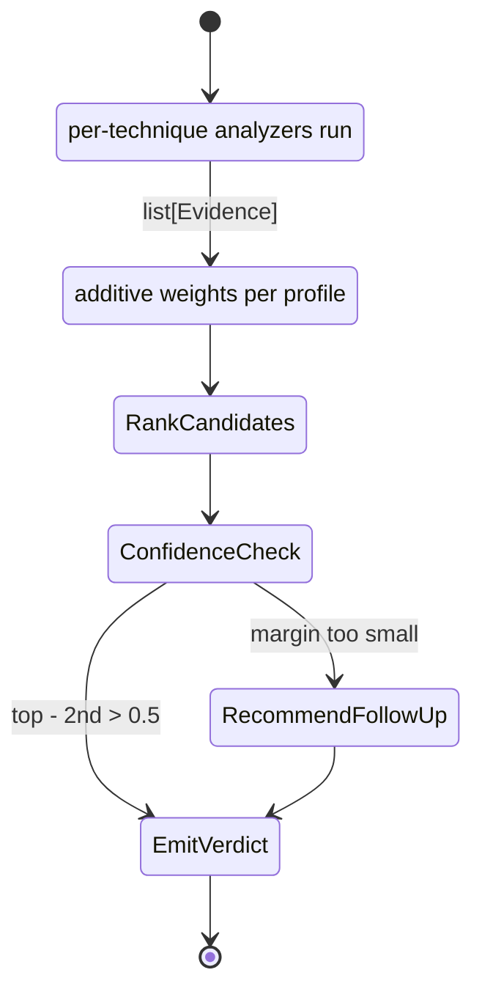

# The diagnose pipeline

`diagnose(spectra)` is the unified analytic entry point: feed it whatever spectra you have, and it returns a `DiagnosticReport` with a verdict, a confidence score, the per-candidate score table, every piece of evidence collected, a step-by-step reasoning trace, and follow-up technique recommendations when confidence is low.

It deliberately avoids learned classifiers. The scoring is additive and transparent so a learner can read every step and audit every weight.

## Pipeline flow



## Evidence collection

Every input spectrum is dispatched to the appropriate technique's analyzer. Outputs are translated into `Evidence` items with three fields:

```python
@dataclass
class Evidence:
    technique: str
    observation: str        # human-readable
    weight: float = 1.0
    favors: tuple[str, ...] = ()        # mineral names this raises score for
    rules_out: tuple[str, ...] = ()     # mineral names this lowers score for
```

For example, a Raman spectrum that matches all six catalog peaks of `corundum_Cr3plus` produces an `Evidence(technique="raman", observation="matched 6/6 catalog peaks for ruby", weight=1.0, favors=("ruby",))`.

## Scoring rules (transparent)

| Technique | Observation | Weight |
|---|---|---|
| Raman | Each catalog mineral matched (weight = matched/total) | 1.0 × match-fraction |
| Raman | Amorphous-like envelope (broad dominant + no narrow strong peaks) | 1.5 (favours amorphous, rules out crystalline) |
| UV-VIS | Each chromophore correctly identified (multi-band requires *all* bands present) | 0.6 |
| UV-VIS | No chromophores detected | 0.3 (favours minerals with empty `uvvis_bands_nm`) |
| XRF | All "major" elements of a profile present | 0.4 × N_majors |
| XRF | Each detected non-matrix element (excludes Al/Si/Ca/Mg/Na/K) | 0.3 |
| LIBS | Same major-set check | 0.3 × N_majors |
| LIBS | Each detected non-matrix element | 0.25 |
| EPR | Top center matches with cosine > 0.5 | 0.7 |
| LA-ICP-MS | Diagnostic isotope set present | 0.5 |

Light elements (H, He, Li, Be, B, C, N, O, F, Ne — the `XRF_INVISIBLE` set in `diagnose.py`) are excluded from the XRF major-set check because they sit below the typical silicon-drift detector window. A profile that lists Be as `major` (e.g. aquamarine) still passes the check on its other majors (Al + Si). Diagnostic credit for those light elements is recovered from LIBS (which detects Be, Li, B optically) or LA-ICP-MS (which counts every isotope above unit mass).

Per-element diagnostic credit deliberately *excludes* the matrix elements `{Al, Si, Ca, Mg, Na, K}`. These appear as majors in so many gemstone profiles (silicates, carbonates, oxides) that a positive detection conveys almost no discriminative information. Trace elements like Cr, Fe, Mn, V, B, Be carry the actual signal — Cr in ruby vs Ti in blue sapphire is the canonical example: both share the corundum host and Al-major XRF, so the verdict turns on the trace.

### Scoring as pseudocode

```python
score: dict[str, float] = {name: 0.0 for name in CATALOG}
for ev in evidence:                        # collected from per-technique analyzers
    for name in ev.favors:
        score[name] += ev.weight
    for name in ev.rules_out:
        score[name] -= ev.weight

ranked   = sorted(score.items(), key=lambda kv: kv[1], reverse=True)
verdict  = ranked[0][0] if ranked[0][1] > 0 else None
top, sec = ranked[0][1], ranked[1][1] if len(ranked) > 1 else 0.0
confidence = top / (top + max(sec, 0)) if top > 0 else 0.0
confidence = min(1.0, confidence + 0.1 * sum(1 for ev in evidence if verdict in ev.favors))
```

Every weight in the table above feeds directly into this loop. There are no hidden priors and no learned coefficients — `diagnose()`'s behaviour is fully described by the catalog data plus the scoring weights.

### Worked numerical example: ruby

Synthesizing all four available technique spectra from the `ruby` profile and feeding them to `diagnose()` produces approximately:

| Evidence item | Favours | Weight |
|---|---|---|
| Raman: dominant peak at 417 cm⁻¹ (FWHM 7.8) | (informational) | 0 |
| Raman: matched 6/6 catalog peaks for `ruby` | ruby | 1.00 |
| Raman: matched 6/6 catalog peaks for `sapphire_blue` | sapphire_blue | 1.00 |
| Raman: matched 6/7 catalog peaks for `white_sapphire` | white_sapphire | 0.86 |
| UV-VIS: chromophore Cr³⁺ d-d (ruby/spinel) | ruby, red_spinel | 0.60 |
| XRF: all major elements of `ruby` present (Al only) | ruby | 0.40 |
| XRF: all major elements of `sapphire_blue` present | sapphire_blue | 0.40 |
| XRF: all major elements of `white_sapphire` present | white_sapphire | 0.40 |
| LIBS: LIBS supports `ruby` chemistry | ruby | 0.30 |
| LIBS: diagnostic Cr present (non-matrix) | ruby, red_spinel, ... | 0.25 |
| **Sum for ruby** | | **2.55** |
| **Sum for sapphire_blue** | | **2.30** |
| **Sum for white_sapphire** | | **1.26** |

`diagnose()` returns `verdict="ruby"` with confidence ≈ 1.0 (after the +0.1-per-favouring-item bump). The runner-up `sapphire_blue` shares the corundum Raman fingerprint and Al-major XRF; the discriminating evidence is the Cr³⁺ chromophore and the Cr LIBS line, both of which favour ruby and not blue sapphire.

## Ranking and confidence

After all evidence is collected, the pipeline:

1. Ranks every catalog entry by total score.
2. Selects the top candidate as the verdict (or `None` if the top score is ≤ 0).
3. Computes confidence as `top / (top + second)`, then bumps it by 0.1 per favoring evidence item, clipped to 1.0.

Two candidates that tie on score produce a low-margin warning in the follow-up recommendations.

## Follow-up recommendations

The pipeline emits human-readable advice when:

- A spectrum from a particular technique was missing.
- The top two candidates differ by less than 0.5 score units.
- Confidence is below 1.0.

Examples include "to distinguish ruby from spinel, run LA-ICP-MS for Cr/Mg ratio" or "missing techniques: epr, laicpms".

## Worked example — capstone tsavorite

Synthesize Raman + UV-VIS + XRF + LIBS for a `tsavorite` profile and feed all four to `diagnose()`. The pipeline:

1. **Raman** detects six peaks at 372/549/879/1006/etc. → matches `tsavorite` and `grossular` and `andradite` (all share the garnet pattern); favors all three.
2. **UV-VIS** sees bands at 430 + 605 nm → recognises `Cr3+ d-d (emerald/alexandrite)` and `V3+ d-d (tsavorite, V-emerald)` chromophores. Tsavorite lists V³⁺ in its profile; grossular and andradite do not.
3. **XRF** detects Ca + Al + Si majors → favors all Ca-Al silicates (tsavorite, grossular, etc.).
4. **LIBS** detects Ca + Al + V → V is non-matrix, favours minerals listing V (tsavorite); the V evidence breaks the tie between tsavorite, grossular, and andradite.

Final verdict: **tsavorite** with confidence ~1.0. The reasoning trace shows every step explicitly. See `examples/19_unknown_stone_capstone.py` for the runnable version.

## Limits and caveats

The pipeline is honest about its weaknesses:

- **Quartz colour-treatment family** — rock crystal, citrine (natural and heat-treated), amethyst, and smoky quartz all share Raman, and several share EPR centres (E1', Al-hole). The pipeline frequently confuses them. The educational point is that *quartz colour-centre history is a genuinely hard case*; a single technique can't fully resolve it. Real labs use complementary FTIR + photoluminescence.
- **Synthetic data fidelity** — the catalog drives the synthesis, so a `diagnose_profile(profile)` round-trip is by construction biased toward the right answer. Real instrument data with drift, polyatomic interferences, and matrix-induced sensitivity changes will degrade scores.
- **Tied verdicts under noise** — when two minerals share most diagnostics (e.g. ruby vs sapphire_blue both being corundum + chromophore), the tie-breaker is the trace-element evidence. Rules out are *not* hard exclusions; they apply weights only.

For a top-level architectural overview see [`architecture.md`](architecture.md). For per-technique deep dives, [`techniques.md`](techniques.md). For the full curriculum walk-through, [`curriculum.md`](curriculum.md).
