# Six analytical techniques

Every technique answers a different question about a sample. This page summarises the physics, the bundled reference data, and the analyzer entry points for each of the six techniques `checkmsg` supports.

| Technique | Question answered | Module | Units |
|---|---|---|---|
| Raman | What is the mineral / molecular structure? | `raman.py` | cm⁻¹ |
| XRF | What elements are in this sample? | `xrf.py` | keV |
| LIBS | What elements are at the ablated micro-spot? | `libs.py` | nm |
| UV-VIS | What gives the sample its colour? | `uvvis.py` | nm |
| EPR | Are there unpaired electrons? Where? | `epr.py` | mT |
| LA-ICP-MS | What concentrations and isotope ratios? | `laicpms.py` | m/z |

The analyzers share a common shape: each accepts a `Spectrum`, calls technique-appropriate preprocessing, detects features, matches against bundled reference data, and returns a structured result.

---

## Raman spectroscopy

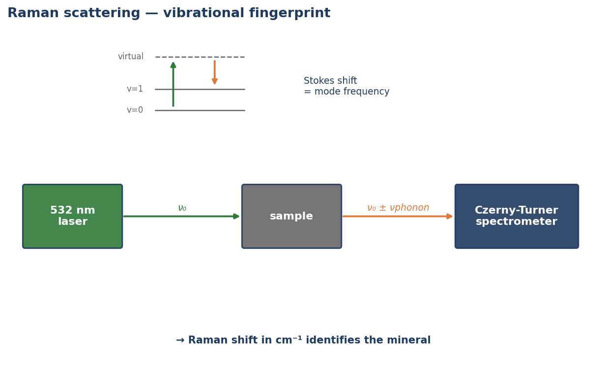

Raman scattering measures the inelastic frequency shift between an incident laser photon and a phonon-perturbed scattered photon. Peaks in cm⁻¹ are invariant with laser wavelength — the same material gives the same fingerprint on a 532 nm or 830 nm laser. This makes Raman the workhorse technique for *mineral identification*.

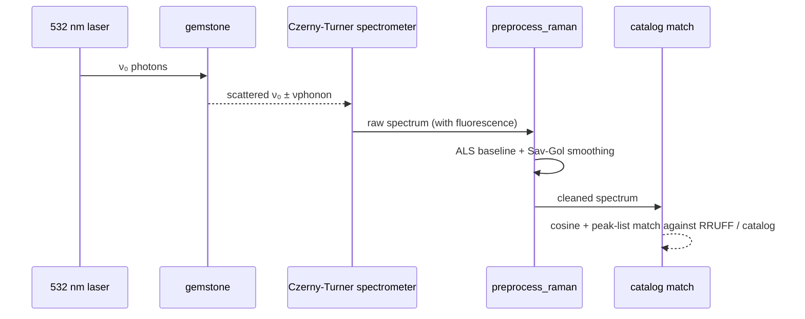

**Bundled data**: RRUFF Raman reference spectra (fetched on demand to `~/.cache/checkmsg/rruff/`) plus the literature-cited Raman peak lists in every `MineralProfile`. Multi-laser corrections (1/λ⁴ scaling, Cr³⁺ resonance enhancement, fluorescence interference) live in `laser.py`; phonon population / blue-shift physics in `temperature.py`.

**Key API**:

```python
from checkmsg.raman import analyze
result = analyze(spec)            # ranks RRUFF candidates by combined cosine + peak score
result.best.mineral               # 'diamond', 'corundum', ...
result.best.cosine                # 0..1
```

**Worked example output** — `examples/01_diamond_vs_moissanite_vs_cz.py`:


Three colourless brilliants, three distinct Raman fingerprints. Diamond's razor-sharp 1332 cm⁻¹ F2g line, moissanite's 767/789 cm⁻¹ folded LO/TO doublet, and cubic zirconia's broad envelope at 269/471/641 cm⁻¹ separate the samples without ambiguity.

---

## X-ray fluorescence (XRF)

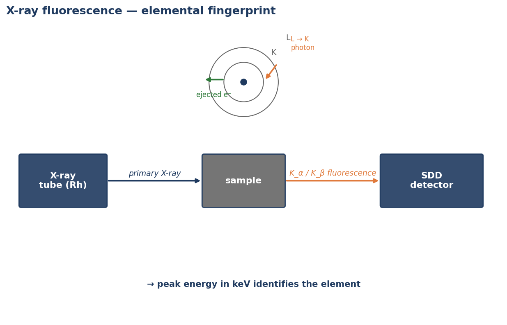

XRF excites inner-shell electrons; outer-shell relaxation emits characteristic X-rays whose energies identify the element. Peaks in keV map to NIST-tabulated K/L transitions.

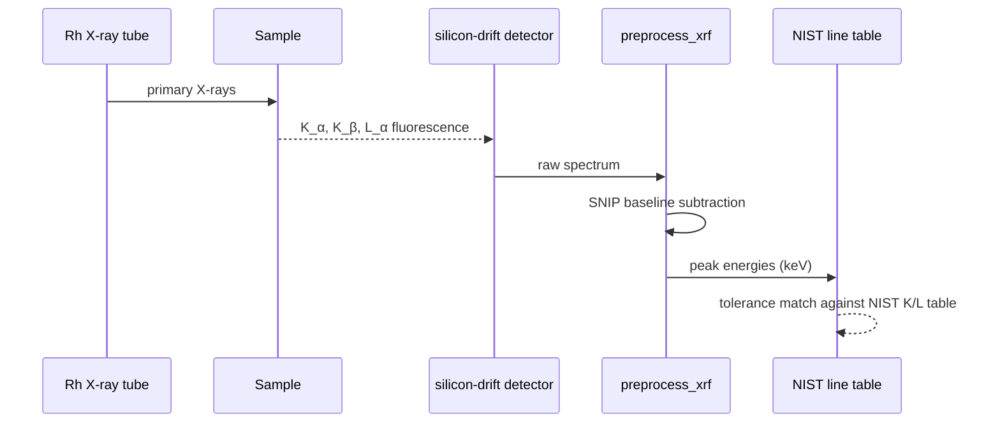

**Bundled data**: ~70 K/L characteristic lines for elements Z=11..82 in `refdata/data/nist_xray_lines.csv`.

**Key API**:

```python
from checkmsg.xrf import identify_elements
res = identify_elements(spec, tolerance_keV=0.05)
[e.element for e in res.elements]    # ['Al', 'Cr', 'V']
```

XRF struggles with light elements (Z<11) — they sit below typical detector windows. For Be / Li / B detection, use LIBS or LA-ICP-MS.

---

## LIBS (laser-induced breakdown spectroscopy)

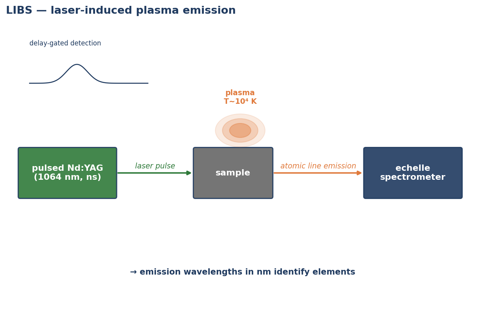

LIBS uses a focused pulsed laser to ablate a small volume of material and excite it into a plasma. The plasma's atomic emission lines (in nm) reveal which elements are present at the spot. Crucially LIBS *can* see Be / Li / B, complementing XRF.

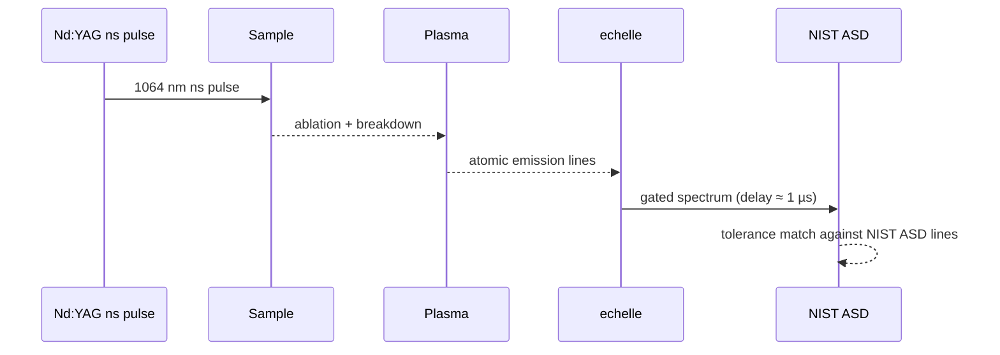

**Bundled data**: a curated subset of NIST Atomic Spectra Database lines covering Al, Be, Cr, Cu, Fe, Ga, Mg, Mo, Ni, Pt, Si, Ti, V (gem-relevant set).

**Key API**:


Same gem family (corundum), four geographic origins → distinct trace-element fingerprints. Mahalanobis distance to bundled centroids classifies each sapphire.

---

## UV-VIS spectroscopy

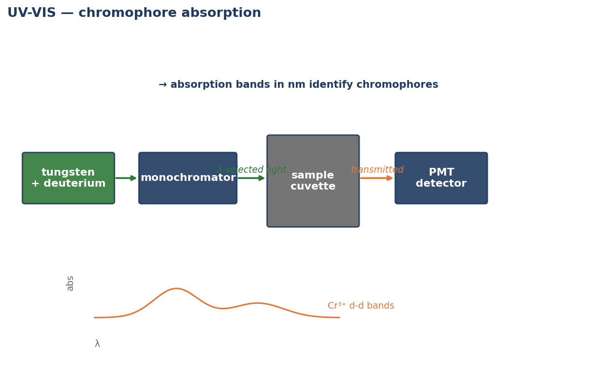

Absorbance vs wavelength reveals *colour origin*: which electronic transition (or charge transfer) absorbs which wavelength. The bundled chromophore table (`refdata/chromophores.py`) maps band patterns to species like Cr³⁺ d-d, Fe²⁺/Ti⁴⁺ IVCT, V³⁺ d-d, etc.

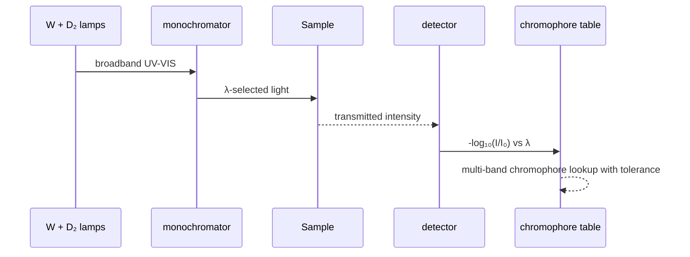

**Key API**:

```python
from checkmsg.uvvis import assign_bands
res = assign_bands(spec)
[c.name for c in res.chromophores()]    # ['Cr3+ d-d (emerald/alexandrite)']
```

**Worked output** — `examples/03_emerald_vs_green_glass.py`:


Real emerald shows the Cr³⁺ d-d doublet (~430 + 605 nm in beryl host). Green glass shows a broad amorphous absorption with no chromophore signature.

---

## Electron paramagnetic resonance (EPR / ESR)

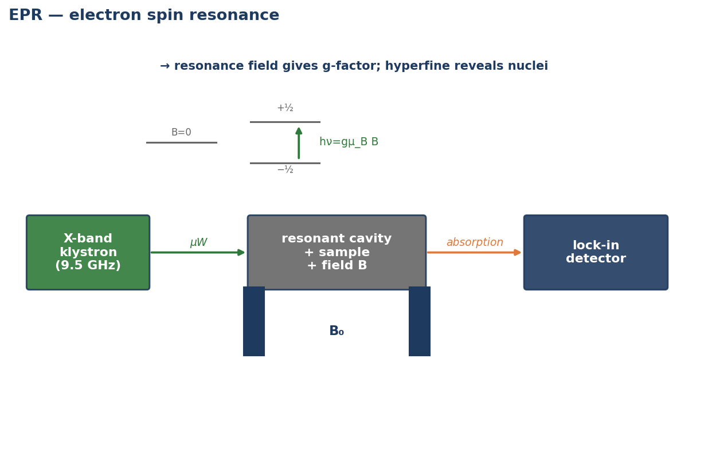

EPR detects unpaired electrons by measuring microwave absorption versus magnetic field. Resonance occurs at `hν = g·μ_B·B` — so the *g-factor* (and any hyperfine splitting from coupled nuclei) identifies the paramagnetic centre. The toolkit ships a bounded but real spin-Hamiltonian simulator.

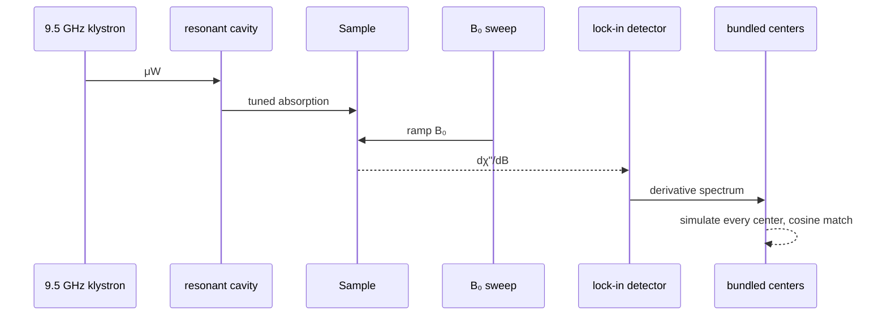

**Bundled data**: nine literature-cited paramagnetic centres (DPPH, free electron, P1 nitrogen in diamond, Ni-HPHT, E1' / Al-hole in quartz, Cr³⁺ in corundum, Fe³⁺ in corundum, Mn²⁺ in calcite).

**Key API**:

```python
from checkmsg.epr import analyze, simulate_field_sweep
result = analyze(spec, frequency_GHz=9.5)
result.best.name                    # 'diamond_P1', 'quartz_E1prime', ...
result.g_factors                    # [2.0024, 2.0026, 2.0028]
```

**Worked output** — `examples/06_epr_unpaired_electrons.py`:


The P1 nitrogen triplet, smoky-quartz E1' singlet, and Mn²⁺ pearl sextet are all resolved by the same spin-Hamiltonian simulator — only the spin system parameters differ.

---

## LA-ICP-MS (laser ablation ICP mass spectrometry)

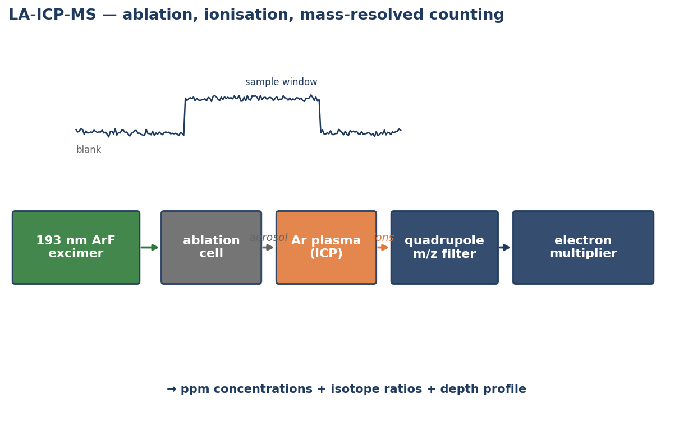

The deepest-resolution technique. A 193 nm laser ablates a micro-spot; the aerosol is carried into an Ar plasma, which ionises everything; ions are mass-filtered and counted. Outputs include ppm-level concentrations, Pb / Sr / U-Pb isotope ratios, REE patterns, and time-resolved depth profiles.

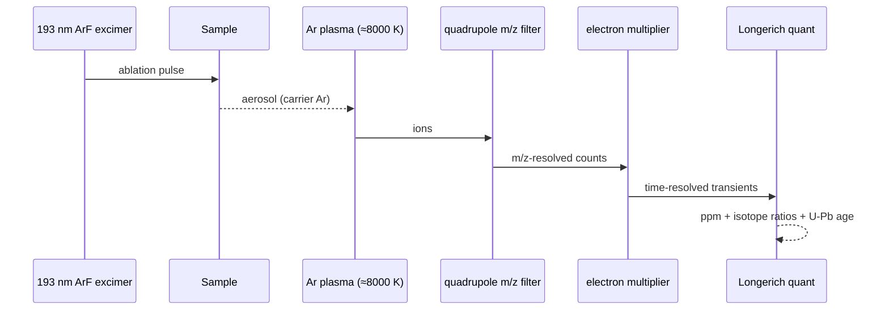

**Bundled data**: ~135 IUPAC isotope abundances, NIST SRM 612/610 preferred values (Pearce 1997), CI chondrite REE (McDonough & Sun 1995), Stacey-Kramers terrestrial Pb composition, Steiger-Jäger U-Pb decay constants.

**Key API**:

```python
from checkmsg.laicpms import analyze, quantify, u_pb_age, pb_ratios, ree_pattern
result = analyze(sample_run, calibration=cal_run, internal_standard=("Ca", 400000.0))
result.concentrations["Mn"].ppm       # 25.4
result.isotope_ratios["207/206"]      # 0.836
result.u_pb_age_Ma                    # 100.0
```

**Worked output** — `examples/07_laicpms_complex_cases.py`:


Pearl natural-vs-cultured discrimination (Mn quant + Pb isotope), HPHT-treated diamond detection (Fe+Co+Ni catalyst signature), surface-coating depth profile, and Cretaceous zircon U-Pb dating — all in one example.
