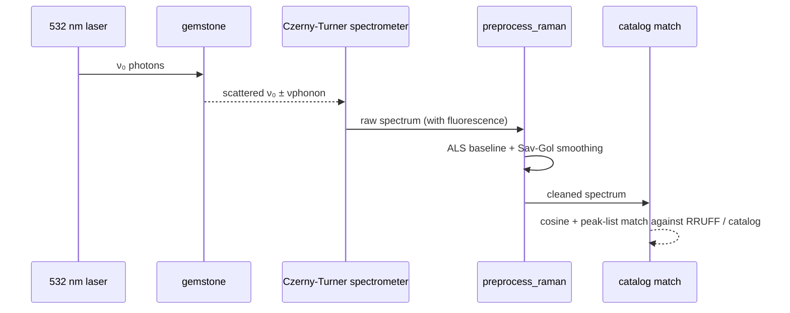
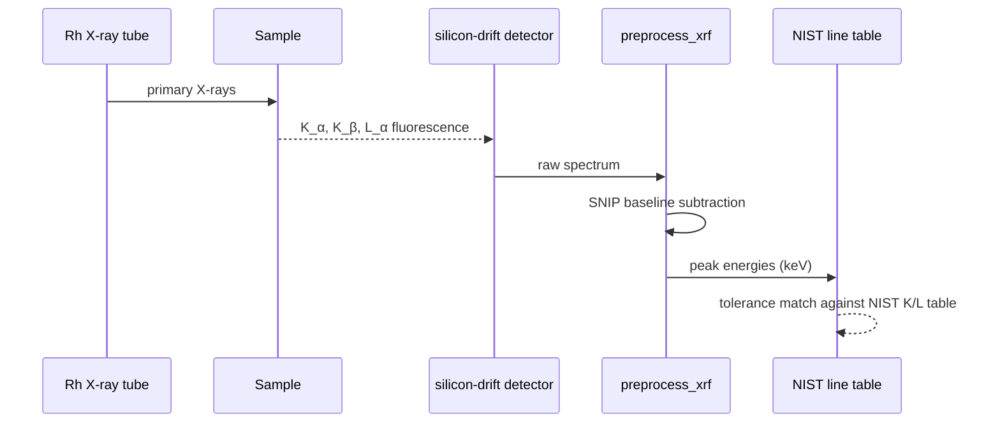
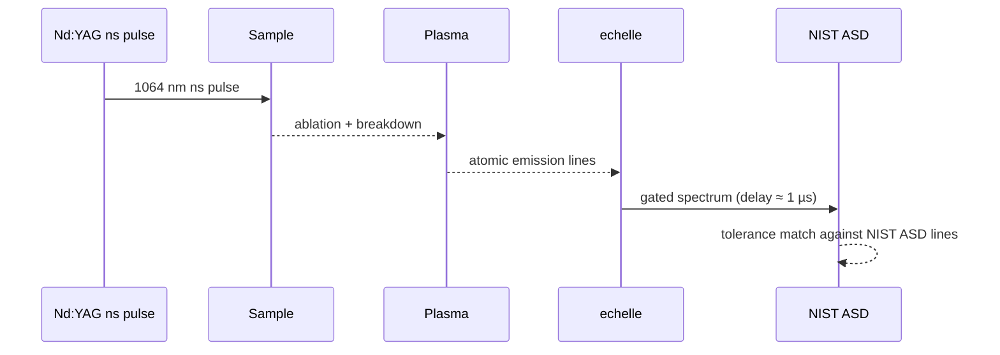
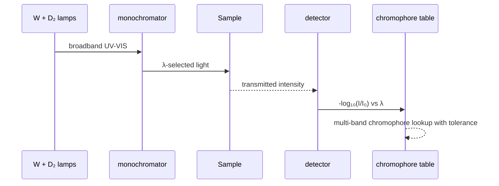
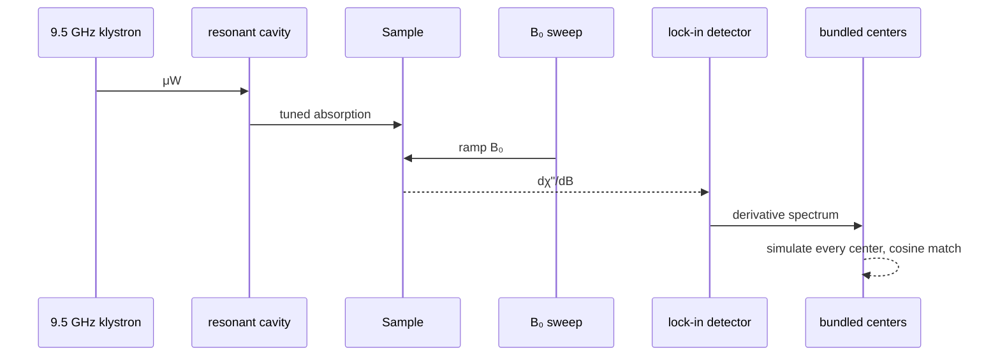
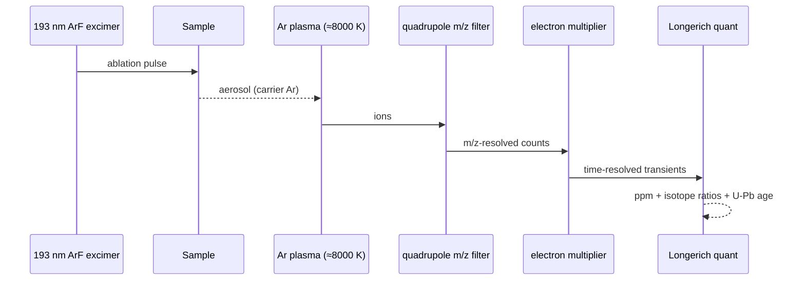
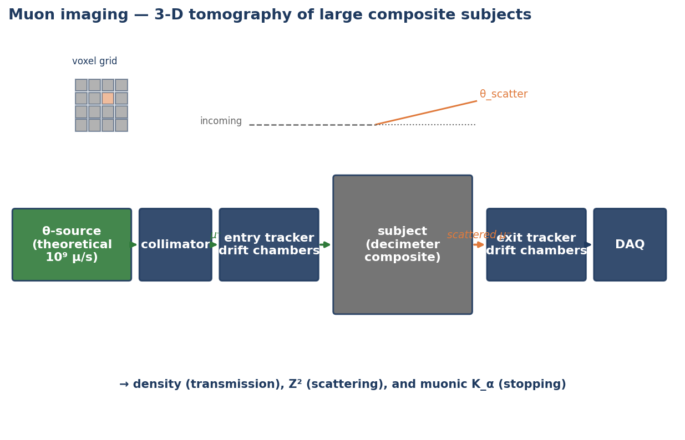
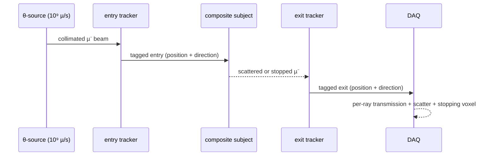

# Six analytical techniques

Every technique answers a different question about a sample. This page summarises the physics, the bundled reference data, and the analyzer entry points for each of the six techniques `checkmsg` supports.

| Technique | Question answered | Module | Units |
|---|---|---|---|
| Raman | What is the mineral / molecular structure? | `raman.py` | cm⁻¹ |
| XRF | What elements are in this sample? | `xrf.py` | keV |
| LIBS | What elements are at the ablated micro-spot? | `libs.py` | nm |
| UV-VIS | What gives the sample its colour? | `uvvis.py` | nm |
| EPR | Are there unpaired electrons? Where? | `epr.py` | mT |
| LA-ICP-MS | What concentrations and isotope ratios? | `laicpms.py` | m/z |

The analyzers share a common shape: each accepts a `Spectrum`, calls technique-appropriate preprocessing, detects features, matches against bundled reference data, and returns a structured result.

---

## Raman spectroscopy


Raman scattering measures the inelastic frequency shift between an incident laser photon and a phonon-perturbed scattered photon. The relevant observable is the wavenumber shift ν̃_shift = 1/λ₀ − 1/λ_s (where λ₀ is the laser wavelength and λ_s the scattered wavelength), which depends only on the vibrational mode energies of the sample, not on the choice of excitation: the same material produces the same set of cm⁻¹ peaks on a 532 nm or an 830 nm laser. This invariance makes Raman the workhorse technique for *mineral identification*.



**Bundled data**: RRUFF Raman reference spectra (fetched on demand to `~/.cache/checkmsg/rruff/`) plus the literature-cited Raman peak lists in every `MineralProfile`. Multi-laser corrections (1/λ⁴ scaling, Cr³⁺ resonance enhancement, fluorescence interference) live in `laser.py`; phonon population / blue-shift physics in `temperature.py`.

**Key API**:

```python
from checkmsg.raman import analyze
result = analyze(spec)            # ranks RRUFF candidates by combined cosine + peak score
result.best.mineral               # 'diamond', 'corundum', ...
result.best.cosine                # 0..1
```

**Worked example output** — `examples/01_diamond_vs_moissanite_vs_cz.py`:


Three colourless brilliants, three distinct Raman fingerprints. Diamond's razor-sharp 1332 cm⁻¹ F2g line, moissanite's 767/789 cm⁻¹ folded LO/TO doublet, and cubic zirconia's broad envelope at 269/471/641 cm⁻¹ separate the samples without ambiguity.

**Physics fundamentals.** The differential cross-section for spontaneous Raman scattering scales as ω₀⁴ |∂α/∂Q|², where ω₀ is the incident angular frequency and ∂α/∂Q is the polarizability derivative with respect to the normal coordinate Q of the vibrational mode. The ω₀⁴ dependence is what makes UV excitation ~80× more efficient than NIR for the same scatterer (cf. example 05). The Stokes/anti-Stokes intensity ratio I_AS/I_S = ((ω₀+ω)/(ω₀−ω))⁴ × exp(−ℏω/kT) provides an internal thermometer (`raman.infer_temperature`); for ℏω ≫ kT the ratio collapses toward zero, which is why anti-Stokes lines are typically weak at room temperature for vibrational modes above ~500 cm⁻¹.

---

## X-ray fluorescence (XRF)


XRF excites inner-shell electrons; outer-shell relaxation emits characteristic X-rays whose energies identify the element. Peaks in keV map to NIST-tabulated K/L transitions.



**Bundled data**: ~70 K/L characteristic lines for elements Z=11..82 in `refdata/data/nist_xray_lines.csv`.

**Key API**:

```python
from checkmsg.xrf import identify_elements
res = identify_elements(spec, tolerance_keV=0.05)
[e.element for e in res.elements]    # ['Al', 'Cr', 'V']
```

XRF struggles with light elements (Z < 11) — they sit below typical silicon-drift detector windows. For Be / Li / B detection, use LIBS or LA-ICP-MS.

**Physics fundamentals.** Characteristic K- and L-line energies follow Moseley's law E = R_y (Z − σ)² (1/n₁² − 1/n₂²), where R_y ≈ 13.606 eV is the Rydberg energy, σ is the screening constant (≈ 1 for K_α, ≈ 7.4 for L_α), and n₁ → n₂ is the inner-to-outer shell transition (n=2 → 1 for K_α, n=3 → 2 for L_α). The K_α₁/K_α₂ doublet from the spin-orbit-split 2p₃/₂ and 2p₁/₂ states is unresolved by typical SDD detectors (~130 eV resolution at Mn K_α), which is why the bundled NIST line table reports a single energy for K_α. The 0.05 keV tolerance used in `xrf.identify_elements` therefore covers natural detector broadening, not physical line width.

---

## LIBS (laser-induced breakdown spectroscopy)


LIBS uses a focused pulsed laser to ablate a small volume of material and excite it into a plasma. The plasma's atomic emission lines (in nm) reveal which elements are present at the ablated spot. LIBS detects light elements (Be, Li, B) that fall below the typical XRF detector window (Z < 11), complementing XRF for full-periodic-table coverage.



**Bundled data**: a curated subset of NIST Atomic Spectra Database lines covering Al, Be, Cr, Cu, Fe, Ga, Mg, Mo, Ni, Pt, Si, Ti, V (gem-relevant set).

**Key API**:


Same gem family (corundum), four geographic origins → distinct trace-element fingerprints. Mahalanobis distance to bundled centroids classifies each sapphire.

**Physics fundamentals.** A focused ns laser pulse delivers ~10⁹–10¹⁰ W/cm² to the sample, ionising and heating it into a plasma at 8000–12000 K. Excited-state populations follow the Saha-Boltzmann distribution, with the line intensity I ∝ g_k A_ki exp(−E_k / kT) / U(T), where g_k is the upper-state degeneracy, A_ki the Einstein coefficient, E_k the upper-level energy, and U(T) the partition function. Detection is gated 0.5–2 µs after the pulse to skip the early continuum dominated by bremsstrahlung and recombination, sampling the plasma during the cooling window when atomic emission dominates. Calibration-free LIBS infers concentrations from line ratios under the local-thermodynamic-equilibrium (LTE) assumption; the toolkit's `libs.identify` takes a simpler matched-line approach, leaving quantitation to LA-ICP-MS.

---

## UV-VIS spectroscopy


Absorbance vs wavelength identifies the electronic transition responsible for the gem's colour: a d-d transition, an intervalence charge transfer (IVCT), or a band-edge absorption that removes a wavelength range from the transmitted light. The complementary colour to the absorbed band is what the eye sees. The bundled chromophore table (`refdata/chromophores.py`) maps band-position patterns to species like Cr³⁺ d-d, Fe²⁺/Ti⁴⁺ IVCT, and V³⁺ d-d.



**Key API**:

```python
from checkmsg.uvvis import assign_bands
res = assign_bands(spec)
[c.name for c in res.chromophores()]    # ['Cr3+ d-d (emerald/alexandrite)']
```

**Worked output** — `examples/03_emerald_vs_green_glass.py`:


Real emerald shows the Cr³⁺ d-d doublet (~430 + 605 nm in beryl host). Green glass shows a broad amorphous absorption with no chromophore signature.

**Physics fundamentals.** Absorbance follows the Beer–Lambert law A = ε(λ) c ℓ, where ε is the molar absorptivity, c the chromophore concentration, and ℓ the path length. For transition-metal d-d transitions the band centre and oscillator strength are governed by the crystal-field splitting parameter Δ_oct (or Δ_tet for tetrahedral coordination); for Cr³⁺ in octahedral coordination, the ⁴A₂g → ⁴T₂g (¹) and ⁴A₂g → ⁴T₁g (²) transitions appear near 17500 cm⁻¹ and 24000 cm⁻¹ in ruby (572 nm and 416 nm respectively). The same Cr³⁺ ion in beryl experiences a smaller Δ_oct and shifts both bands to longer wavelength (~605 + 430 nm), which is why ruby and emerald — same ion, different host — produce subtly different chromophore patterns. Spin-forbidden d-d transitions (e.g. Mn²⁺) are typically 10⁴ × weaker than spin-allowed and require higher concentrations or longer path lengths to detect.

---

## Electron paramagnetic resonance (EPR / ESR)


EPR detects unpaired electrons by measuring microwave absorption versus magnetic field. Resonance occurs when hν = g μ_B B (the electron Zeeman condition), where g is the dimensionless Landé factor, μ_B the Bohr magneton, and B the static magnetic field. For a free electron g ≈ 2.00232; transition-metal centres deviate by 1–10 % depending on the local crystal field and spin-orbit coupling. Hyperfine coupling to nearby nuclear spins splits the resonance into multiplets whose pattern identifies the coupled nucleus (e.g. ¹⁴N gives a triplet, ⁵⁵Mn a sextet). The toolkit ships a bounded but real spin-Hamiltonian simulator.



**Bundled data**: nine literature-cited paramagnetic centres (DPPH, free electron, P1 nitrogen in diamond, Ni-HPHT, E1' / Al-hole in quartz, Cr³⁺ in corundum, Fe³⁺ in corundum, Mn²⁺ in calcite).

**Key API**:

```python
from checkmsg.epr import analyze, simulate_field_sweep
result = analyze(spec, frequency_GHz=9.5)
result.best.name                    # 'diamond_P1', 'quartz_E1prime', ...
result.g_factors                    # [2.0024, 2.0026, 2.0028]
```

**Worked output** — `examples/06_epr_unpaired_electrons.py`:


The P1 nitrogen triplet, smoky-quartz E1' singlet, and Mn²⁺ pearl sextet are all resolved by the same spin-Hamiltonian simulator — only the spin system parameters differ.

**Physics fundamentals.** The full spin Hamiltonian implemented in `epr.simulate_field_sweep` is

H = μ_B B · g · S + S · D · S + Σᵢ ( S · Aᵢ · Iᵢ − g_n,i μ_N B · Iᵢ )

where S is the electron spin operator, B the static magnetic field, g the (in general anisotropic) g-tensor, D the zero-field splitting tensor (with axial parameter D_MHz and rhombic E_MHz in the bundled centres), and the sum runs over hyperfine-coupled nuclear spins Iᵢ with coupling tensor Aᵢ and nuclear g-factor g_n,i. The simulator constructs H in the |M_S, M_I, …⟩ product basis using `np.kron`, batch-diagonalises across the field grid via `np.linalg.eigh`, applies the perpendicular CW transition selection rule (matrix elements of S_⊥ = S − (n·S)n where n is the field direction), and integrates over a θ/φ powder grid (auto-reduced for axial / isotropic systems). The output is the absorption derivative dχ″/dB, which is what a CW spectrometer with field-modulation lock-in detection records.

---

## LA-ICP-MS (laser ablation ICP mass spectrometry)


The most sensitive technique in the toolkit, capable of resolving sub-ppm trace elements and individual isotopes. A 193 nm laser ablates a micro-spot; the aerosol is carried by argon into an inductively-coupled argon plasma (~8000 K) that fully ionises the sample; ions are mass-filtered by a quadrupole and counted on an electron multiplier. Outputs include ppm-level concentrations (calibrated against NIST glass standards via the Longerich internal-standard equation), Pb / Sr isotope ratios with mass-bias correction, U-Pb concordant ages, REE patterns, and time-resolved depth profiles.



**Bundled data**: 135 IUPAC isotope abundances, NIST SRM 612/610 preferred values (Pearce, Perkins, Westgate, Gorton, Jackson, Neal & Chenery 1997, *Geostandards Newsletter* 21:115), CI chondrite REE (McDonough & Sun 1995, *Chem. Geol.* 120:223), present-day terrestrial Pb composition (Stacey & Kramers 1975, *Earth Planet. Sci. Lett.* 26:207), and U-Pb decay constants (Steiger & Jäger 1977, *Earth Planet. Sci. Lett.* 36:359).

**Key API**:

```python
from checkmsg.laicpms import analyze, quantify, u_pb_age, pb_ratios, ree_pattern
result = analyze(sample_run, calibration=cal_run, internal_standard=("Ca", 400000.0))
result.concentrations["Mn"].ppm       # 25.4
result.isotope_ratios["207/206"]      # 0.836
result.u_pb_age_Ma                    # 100.0
```

**Worked output** — `examples/07_laicpms_complex_cases.py`:


Pearl natural-vs-cultured discrimination (Mn quant + Pb isotope), HPHT-treated diamond detection (Fe+Co+Ni catalyst signature), surface-coating depth profile, and Cretaceous zircon U-Pb dating — all in one example.

**Physics fundamentals.** Quantitation follows the Longerich, Jackson & Günther 1996 internal-standard equation:

C_sample,i = (I_sample,i − I_blank,i) / (I_cal,i − I_blank,cal,i) × C_cal,i × ( C_IS,sample / C_IS,sample_apparent )

where C_sample,i is the unknown sample concentration of element i, I_sample,i and I_cal,i are the blank-subtracted count rates in the sample and calibration runs, C_cal,i is the certified concentration in the calibration glass (NIST SRM 612 or 610), and the bracketed term is the internal-standard correction: C_IS,sample is the *known* concentration of the internal-standard element (e.g. Ca = 400 000 ppm in calcite), and C_IS,sample_apparent is its *uncorrected* concentration computed from the same equation without the IS correction. The IS correction normalises out matrix-induced sensitivity changes between the calibration glass and the sample.

U-Pb concordant ages come from inverting the Steiger & Jäger 1977 decay equations: from the measured ²⁰⁶Pb*/²³⁸U ratio, t = (1/λ_238) ln(1 + ²⁰⁶Pb*/²³⁸U); from ²⁰⁷Pb*/²³⁵U, t = (1/λ_235) ln(1 + ²⁰⁷Pb*/²³⁵U). The two ages must agree (concordance) within the user-specified tolerance for the verdict to be issued; discordant data indicates Pb loss, common-Pb contamination, or inheritance and triggers a `ValueError`. Mass-bias correction for Sr isotopes uses the standard linear law normalised to the natural ⁸⁶Sr/⁸⁸Sr = 0.1194.

---

## Muon imaging (experimental)



Muon imaging — *muography* — uses a beam of negative muons to image the internal structure of large composite subjects. Three observables are extracted:

  - **Transmission**: the fraction of muons that survive a given line of sight maps the integrated mass thickness along that path.
  - **Multiple Coulomb scattering**: the RMS scattering angle after transit scales as 1/X₀, with the radiation length X₀ inversely proportional to Z². High-Z inclusions (Pt, Au, Pb, U) produce strong scattering even at low integrated mass.
  - **Muonic K_α emission**: a stopping negative muon cascades into K-shell orbits and emits muonic X-rays at energies that scale roughly as Z² × (m_µ/m_e) × 13.6 eV. These energies — 75 keV for C up to 6 MeV for Pb — identify the element non-destructively.

This module is **experimental** and explicitly assumes a "theoretical on-demand high muon source" delivering ~10⁹ µ/s collimated. Real surface-muon facilities (PSI, J-PARC) reach ~10⁸ µ/s; cosmic-ray muography uses ~1 µ cm⁻² min⁻¹.



**Bundled data**: 18 materials (gem hosts + structural metals) with X₀ from Tsai 1974, *Rev. Mod. Phys.* 46:815; muonic K_α energies for 47 elements from Engfer, Schneuwly, Vuilleumier, Walter & Zehnder 1974, *At. Data Nucl. Data Tables* 14:509; physics constants from PDG 2024, *Phys. Rev. D* 110:030001.

**Key API**:

```python
from checkmsg.muon import VoxelGrid, MuonSource, analyze
g = VoxelGrid.filled((32, 32, 32), "corundum", spacing_mm=(2.0, 2.0, 2.0))
g.set_box((12, 12, 12), (20, 20, 20), "platinum")
src = MuonSource(mean_momentum_MeV=80, flux_per_s=1e9, polarity="negative")
img = analyze(g, src, transmission=True, scattering=True, muonic_xray=True)
img.density_map                        # 3-D ndarray, reconstructed density
img.scattering_density_map             # 3-D ndarray, Z²-weighted scatter density
img.muonic_xray_spectrum               # Spectrum (technique="muon-xray", units="keV")
```

**Physics fundamentals.** Energy loss follows Bethe-Bloch (PDG 28.31.5):

−dE/(ρ dx) = K (Z/A) (1/β²) [ ½ ln(2 m_e β²γ² T_max / I²) − β² − δ/2 ]

where K = 0.30707 MeV cm² mol⁻¹, m_e is the electron mass, I is the mean excitation potential, and δ is the density-effect correction (set to zero in our regime). The continuous-slowing-down approximation (CSDA) range is the integral of 1/(dE/dx) over kinetic energy from the entry point down to a low-energy cutoff; for surface muons (~30 MeV/c) the CSDA range in water is ≈ 1.3 mm.

Multiple Coulomb scattering follows the Highland approximation:

θ₀ = (13.6 MeV / β c p) × √(x / X₀) × (1 + 0.038 ln(x / X₀))

where p is the muon momentum, x is the path length expressed as a mass thickness (g/cm²), and X₀ is the material's radiation length. Scattering at the same x grows as Z²/A in the underlying X₀ formula, which is what makes scattering muography selectively sensitive to high-Z material.

Muonic atom K_α emission uses the hydrogenic Bohr-radius scaling: replacing the electron with a muon shrinks the Bohr radius by m_e/m_µ ≈ 1/207, so the K-shell binding scales as Z² × (m_µ/m_e) × R_y ≈ Z² × 2820 eV. Reduced-mass and finite-nuclear-size corrections lower the high-Z energies by 5–10 % from the point-Coulomb prediction; the bundled values (Engfer et al. 1974) include these corrections.

**Out of scope**: muon decay in flight, hadronic interactions in heavy materials, pion/kaon contamination of the beam, π⁻ atomic capture, full muonic-cascade transition probabilities (we model only the dominant K_α line), and muon spin rotation / relaxation (µSR is a distinct technique addressing a different physics regime).

**Worked output** — `examples/20_muon_tomography.py`:


Three composite subjects: a sealed reliquary (transmission), a gem geode with Pt inclusion (scattering), and a meteorite cross-section with Au inclusion (transmission + scattering + muonic K_α).
